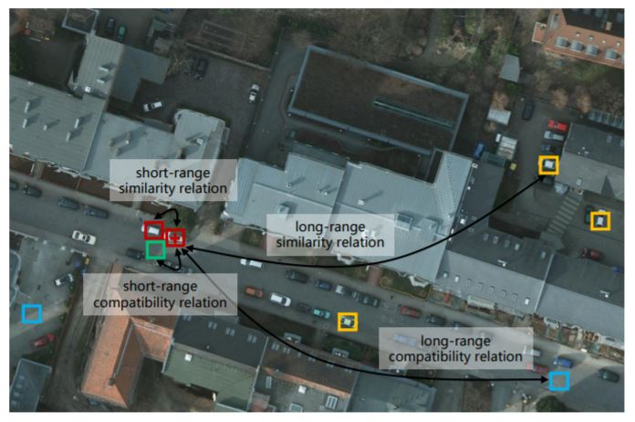
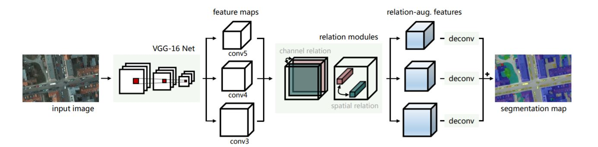
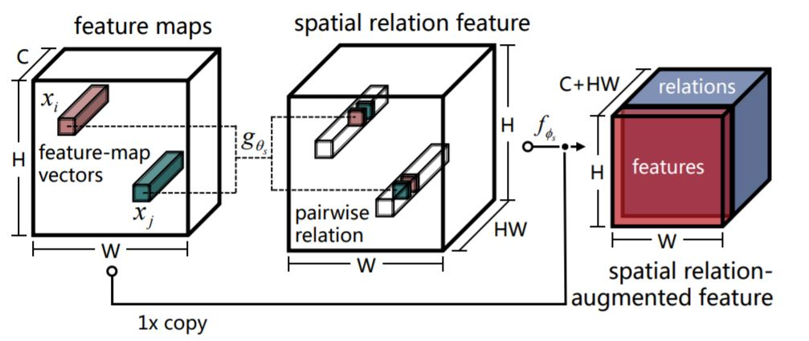
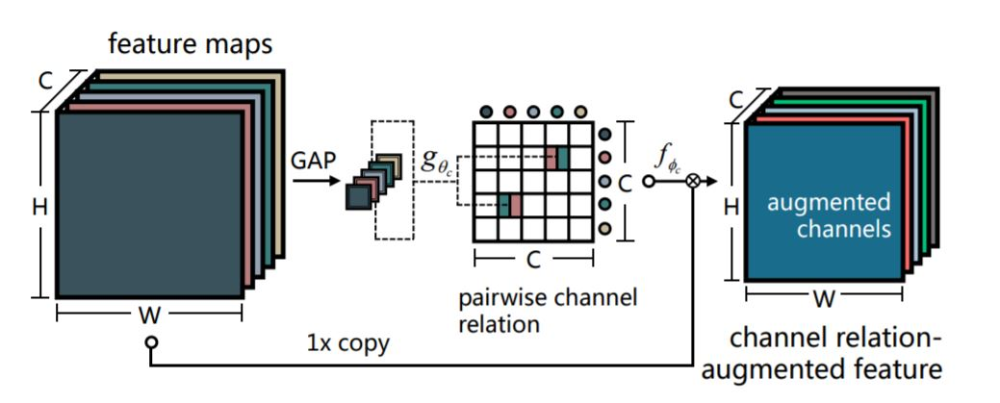
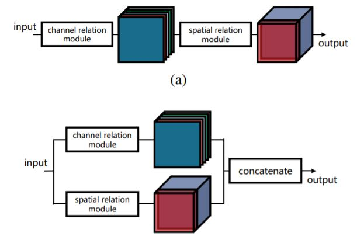
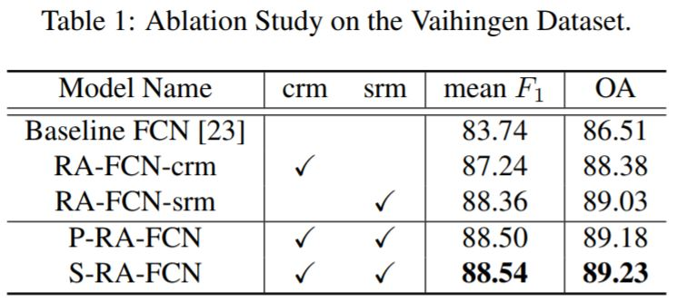
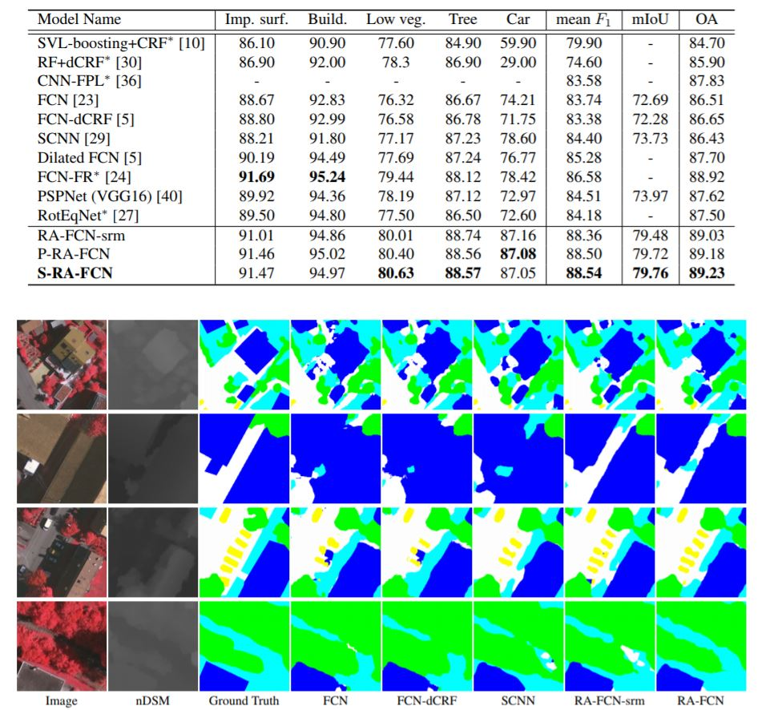
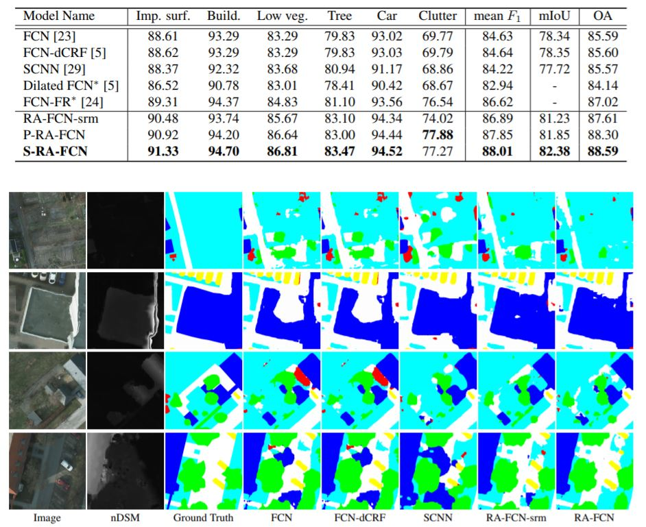

**摘要**：CNN 使用具
有局部感受野的卷积运算导致其对空间上下文关系建模的局限性。人们试图通过在网
络中使用 **图形模型** 或 **空间传播模块** 来解决该问题。但是这些模型通常无法捕获实体之间的长
距离空间关系，这导致空间碎片化的预测。此外，最近的研究表明，特征通道方面的信息也
是 CNN 中的关键部分。作者提出了两个简单而有效的网络单元，即 **空间关系模
块** 和 **信道关系模块**，以学习和推理任何两个空间位置或特征图之间的全局关系，然后生成关
系增强特征表示。空间和信道关系模块是通用的和可扩展的，并且可以在现有的完全卷积网
络（FCN）框架以即插即用的方式使用。并且在ISPRS Vaihingen和Potsdam数据集上的实验结果表明，这两个关系增强模块在相对于基线方法方面取得了显着的进步。

----

### 1、提出的动机：
#### 1.1、什么是空间上下文关系
&emsp;&emsp;空间上下文关系可以被认为是图像中的区域之间的语义相似关系。它能够为语义分割任务提供重要线索。空间上下文关系涉及兼容性和不相容性关系。举个例子：车辆可能被驾驶或停放在路面上，一块草坪不太可能出现在建筑物的屋顶上。这些都是空间上下文的兼容性和不相容性关系。更具代表性的空间上下文关系如下图所示：<br><br>
<br><br>
&emsp;&emsp;红框与绿框、红框与红框分别代表着上下文关系中的短距离包含关系以及短距离的相似关系（车与道路、车与车）；红框与蓝框、红框与黄框分别代表着长距离包含关系以及长距离相似关系。<br>
&emsp;&emsp;但是由于卷积层只有局部有效的感受野，导致其不能建模长距离的空间关系。虽然可以通过大小不同的卷积核来缓解这一问题，但是效果也只是比单一卷积核要稍微好一点。于是人们试图通过图像模型与空间传播模型来缓解这一问题。但是这两个方向的方法也各有各的缺点。并且它在具有更复杂对象的空间场景中，对长距离空间信息的建模效果也不尽如人意。

#### 1.2、图像模型
&emsp;&emsp;有许多基于图形模型的方法（如马尔可夫随机场、条件随机场等）用于实现更好的语义分割结果。例如，deeplab v1中的工作利用条件随机场（CRF）作为后处理来提高语义分割的性能。并且也有研究进一步使CRF模块可微分并将其整合为网络内的联合训练部分。然而，由于需要迭代推理过程，这些方法对外观变化敏感并且计算开销代价很大。

#### 1.3、空间传播模型
&emsp;&emsp;这些研究在如下论文中：
> [1]M. Maire, T. Narihira, and S. X. Yu. Affinity CNN: Learning pixel-centric pairwise relations for
figure/ground embedding. In IEEE International Conference on Computer Vision and Pattern
Recognition (CVPR), 2016.<br><br>
[2]S. Liu, S. De Mello, J. Gu, G. Zhong, M.-H. Yang, and J. Kautz. Learning affinity via spatial
propagation networks. In Advances in Neural Information Processing Systems (NIPS), 2017.<br><br>
[3] T.-W. Ke, J.-J. Hwang, Z. Liu, and S. X. Yu. Adaptive affinity fields for semantic segmentation. In
European Conference on Computer Vision (ECCV), 2018.<br><br>
[4]S. Liu, G. Zhong, S. De Mello, J. Gu, V. Jampani, M.-H. Yang, and J. Kautz. Switchable temporal<br><br>
propagation network. In European Conference on Computer Vision (ECCV), 2018.
[5] X. Cheng, P. Wang, and R. Yang. Depth estimation via affinity learned with convolutional<br><br>
spatial propagation network. In European Conference on Computer Vision (ECCV), 2018.
[6]S. Bell, C. Lawrence Zitnick, K. Bala, and R. Girshick. Inside-outside net: Detecting objects in
context with skip pooling and recurrent neural networks. In IEEE International Conference on Computer Vision and Pattern Recognition (CVPR), 2016.<br><br>
[7]X. Pan, J. Shi, P. Luo, X. Wang, and X. Tang. Spatial as deep: Spatial CNN for traffic scene
understanding. In AAAI Conference on Artificial Intelligence (AAAI), 2018.

&emsp;&emsp;然而这些方法的空间传播本质上是串行的，因此每个位置只能从其邻居接收信息。


### 2、提出的模型：
#### 2.1、网络结构
&emsp;&emsp;如下图所示，所提出的网络将 VGG-16作为提取多级特征的主干。conv3，
conv4 和 conv5 的输出被馈送到通道和空间关系模块，以生成关系增强特征。 随后将这些特征馈送到具有 1×1 滤波器的相应卷积层中，以将信道数量压缩到类别数量。最后，将卷积特征图上采样到期望的全分辨率，并且求和以生成最终分割图。<br><br>
<br><br>

#### 2.2 空间关系模块
&emsp;&emsp;空间关系模块（SRM）的逻辑结构如下图所示：<br><br>
<br><br>
&emsp;&emsp;通俗点来说，以 VGG16 中 conv3 产生的特征图的处理为例。其初始大小为 H×
W×C。首先将其进行 us与 vs的操作。他们都代表这 1*1 的卷积运算。操作后其大小仍为 H×W×C。随后将 us与 vs产生的结果 reshape 成 HW×C 和 C×HW。然后使它们相乘得到 HW×HW 的特征图。重新 reshape为H × W × HW的大小。最后将结果经过 Relu 函数的处理后与conv3产生特征图进行concat 操作得到最后的结果。
#### 2.3 信道关系模块
&emsp;&emsp;信道关系模块（CRM）的逻辑结构如下图所示：<br><br>
<br><br>
&emsp;&emsp;以 VGG16 中 conv3 产生的特征图的处理为例。其初始大小为 H×
W×C。首先将其进行全局平均池化操作到大小为 1×1×C。随后同样进行其进行
us与 vs的操作。处理后大小仍为 1×1×C。然后自身相乘得到 C×C 的特征图。其中位于（p，q）的元素指示 gθc（Xp，Xq）。将特征图送入 fφc进行处理（相
当于计算了每一个通道相对于其他通道的权重）。得到的结果再与 conv3 产生的
特征图相乘得到最后的输出（加权处理）。

### 3、试验
#### 3.1、消融实验
&emsp;&emsp;为了验证这些模块的有效性，进行了消融实验（参见下表）。值得一提的是，
不是同时使用空间和信道关系模块，而是分别嵌入在主干（即，VGG-16）的顶部。
此外，我们还讨论了关系模块的不同集成策略（即并行和串行，参加下图）。<br><br>
<br><br>
<br><br>
&emsp;&emsp;消融实验在 Vaihingen 数据集上进行。从表 1 中可以看出，与基线 FCN（VGG-16）
相比，关系模块带来了显着的改进，并且各种集成方案对我们的网络性能产生轻
微影响。详细地说，仅使用信道关系模块得出平均 F1 得分为 87.24％的结果，这带来了 3.50％的改善。同时，仅具有空间关系模块的 RA-FCN 比平均 F1 得分
优于基线 4.62％。相对于 RA-FCN-crm 和 RA-FCN-srm，关系模块的并行模式在平均
F1 得分中增加了 1.26％和 0.14％。此外，还讨论了串行聚合策略，结果表明它与其他模型相比表现更优越。更具体地说，这种设计获得了最高的平均 F1 得分，
88.54％，以及最高的整体准确率，89.23％。
#### 3.2、ISPRS Vaihingen上的对比结果

#### 3.3、Potsdam上的对比结果

### 4、代码复现：
&emsp;&emsp;由于该论文的代码没有开源，所以我只能参照论文的业务逻辑复现了其tensorflow版本。vgg16.py用于构建特征提取骨干网络并导入预训练参数，RelationModel.py用于构建所提出的关系增强网络。

```
import numpy as np
import tensorflow as tf

class vgg16():
    def __init__(self,imgs,vgg16_path = "VGG16_Weight/vgg16.npy"):
        self.imgs = imgs
        self.data_dict = np.load(vgg16_path, encoding='latin1').item()  # 读取vgg_16数据文件
        self.convlayers()

    def saver(self):
        return  tf.train.Saver()

    def conv(self,name,input_data):
        '''
        :param name:这个卷积层的名字
        :param input_data: 输入图像数据
        :param out_channel: 输出通道数
        :param trainable:参数是否变动
        :return: 输出卷集后的特征图像
        '''
        with tf.variable_scope(name):
            # tf.get_variable获取一个已经存在的变量或者创建一个新的变量.
            # name：新变量或现有变量的名称。
            # shape：新变量或现有变量的形状。
            # dtype：新变量或现有变量的类型（默认为DT_FLOAT）。
            kernel = self.get_conv_filter(name)
            biases = self.get_bias(name)
            conv_res = tf.nn.conv2d(input_data,kernel,[1,1,1,1],padding="SAME")
            res = tf.nn.bias_add(conv_res,biases)
            out = tf.nn.relu(res,name=name)
        return out

    def get_conv_filter(self, name):
        # 根据名字检索到对应的卷积核
        return tf.constant(self.data_dict[name][0], name="filter")

    def get_bias(self, name):
        # 根据名字检索到对应的偏置
        return tf.constant(self.data_dict[name][1], name="biases")

    def maxpool(self,name,input_data):
        '''
        :param name: 这个最大池化层的名字
        :param input_data: 输入数据
        :return: 返回最大池化后的结果
        '''
        out = tf.nn.max_pool(input_data,[1,2,2,1],[1,2,2,1],padding="SAME",name=name)
        return  out

    def convlayers(self):
        #conv1
        self.conv1_1 = self.conv("conv1_1",self.imgs)
        self.conv1_2 = self.conv("conv1_2",self.conv1_1)
        self.pool1 = self.maxpool("pool1",self.conv1_2)
        print(self.pool1.shape)

        #conv2
        self.conv2_1 = self.conv("conv2_1", self.pool1)
        self.conv2_2 = self.conv("conv2_2", self.conv2_1)
        self.pool2 = self.maxpool("poo2", self.conv2_2)
        print(self.pool2.shape)

        #conv3
        self.conv3_1 = self.conv("conv3_1", self.pool2)
        self.conv3_2 = self.conv("conv3_2", self.conv3_1)
        self.conv3_3 = self.conv("conv3_3", self.conv3_2)
        self.pool3 = self.maxpool("pool3", self.conv3_3)
        print(self.pool3.shape)

        #conv4
        self.conv4_1 = self.conv("conv4_1", self.pool3)
        self.conv4_2 = self.conv("conv4_2", self.conv4_1)
        self.conv4_3 = self.conv("conv4_3", self.conv4_2)
        self.pool4 = self.maxpool("pool4", self.conv4_3)
        print(self.pool4.shape)

        #conv5
        self.conv5_1 = self.conv("conv5_1", self.pool4)
        self.conv5_2 = self.conv("conv5_2", self.conv5_1)
        self.conv5_3 = self.conv("conv5_3", self.conv5_2)
        self.pool5 = self.maxpool("pool5", self.conv5_3)
        print(self.pool5.shape)
```

```
import tensorflow as tf
from utils import vgg16

class RelationModel():
    def __init__(self,images,batch_size):
        self.batch_size = batch_size
        vgg = vgg16.vgg16(images)
        #得到后续输入空间与通道关系模块的conv3,conv4,conv5
        self.conv3 = vgg.pool3
        self.conv4 = vgg.pool4
        self.conv5 = vgg.pool5

        self.channel(self.conv3,'channel_conv3')
        self.spatial(self.conv3,'spatial_conv3')

    def forward(self):
        #conv3
        temp1 = self.spatial(self.channel(self.conv3, 'channel_conv3'), 'spatial_conv3')
        temp1= tf.image.resize_bilinear(temp1, (224,224))

        # conv4
        temp2 = self.spatial(self.channel(self.conv4, 'channel_conv3'), 'spatial_conv3')
        temp2 = tf.image.resize_bilinear(temp2, (224, 224))

        # conv5
        temp3 = self.spatial(self.channel(self.conv5, 'channel_conv3'), 'spatial_conv3')
        temp3 = tf.image.resize_bilinear(temp3, (224, 224))

        out = tf.concat((temp1,temp2,temp3),axis=3)


    def channel(self,input_data,name):
        #通道关系模块

        c = input_data.get_shape()[-1]

        # 全局池化操作
        x = self.Global_AveragePool(input_data,name)

        # Us与Vs操作，即1*1卷积
        temp1 = tf.reshape(self.conv11(x,name+'_1'),[self.batch_size,c,1])
        temp2 = tf.reshape(self.conv11(x,name+'_2'),[self.batch_size,1,c])

        # gθc处理
        channel_data = tf.matmul(temp1,temp2)

        #  fφc处理
        channel = [[[0 for i in range(c)] for j in range(c)] for k in range(self.batch_size)]
        for i in range (0,self.batch_size):
            for j in range(0,c):
                channel[i][j] = tf.nn.softmax(channel_data[i][j])
        #矩阵原始特征向量与通道关系向量的矩阵乘法
        for i in range(0, self.batch_size):
            channel[i] = tf.transpose(channel[i])
        reshape_input = tf.reshape(input_data,[self.batch_size,input_data.get_shape()[1]*input_data.get_shape()[2],c])
        out = tf.matmul(reshape_input,channel)
        return tf.reshape(out,[self.batch_size,input_data.get_shape()[1],input_data.get_shape()[2],c])

    def spatial(self,input_data,name):
        #空间关系模块
        c = input_data.get_shape()[-1]
        H = input_data.get_shape()[1]
        W = input_data.get_shape()[2]
        temp1 = tf.reshape(self.conv11(input_data, name + '_1'), [self.batch_size,H * W, c])
        temp2 = tf.reshape(self.conv11(input_data, name + '_2'), [self.batch_size,H * W, c])
        temp2 = tf.transpose(temp2,perm=[0, 2, 1])
        spatial = tf.matmul(temp1,temp2)
        spatial = tf.reshape(spatial,[self.batch_size,H,W,H*W])
        return (tf.concat((spatial,input_data),axis=3))


    def conv11(self,input_data,name):
        #1*1卷积
        '''
            :param name:这个卷积层的名字
            :param input_data: 输入图像数据
            :return: 输出卷集后的特征图像
        '''
        in_channel = input_data.get_shape()[-1]
        out_channel = input_data.get_shape()[-1]
        with tf.variable_scope(name):
            kernel = tf.get_variable("weight", [1, 1, in_channel, out_channel], dtype=tf.float32, trainable=False)
            biases = tf.get_variable("biases", [out_channel], dtype=tf.float32, trainable=False)
            conv_res = tf.nn.conv2d(input_data, kernel, [1, 1, 1, 1], padding="SAME")
            res = tf.nn.bias_add(conv_res, biases)
        return  res

    def Global_AveragePool(self,input_data,name):
        #全局平均池化
        '''
            :param name:这个池化层的名字
            :param input_data: 输入图像数据
            :return: 输出全局池化后的特征图像
        '''
        size = input_data.get_shape()[1]
        return tf.nn.avg_pool(input_data,[1,size,size,1],[1,size,size,1],padding="SAME",name=name)

images = tf.placeholder(tf.float32, [1, 224, 224, 3])
RelationModel(images,1)
```

### 5、结论：
&emsp;&emsp;作者引入了两个有效的网络模块，即空间关系模块和信道关系模
块，以实现网络中的空间关系的获取，用于空中场景中的语义分割。对存在长距离空间
关系的航空数据集进行全面的消融实验表明，两个关系模块都已经学习到了对象和
特征图之间的全局关系信息。
