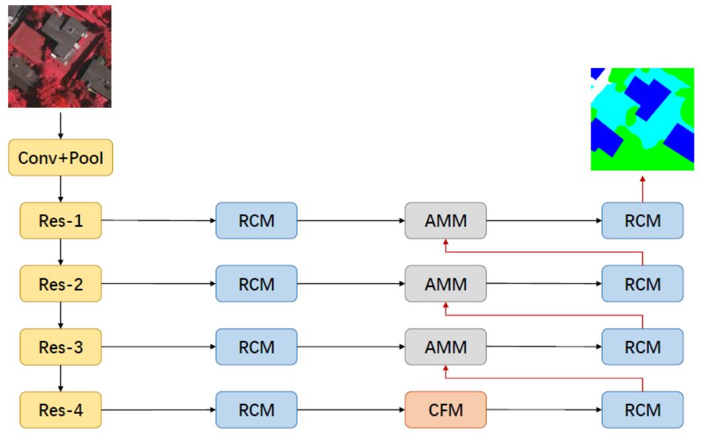
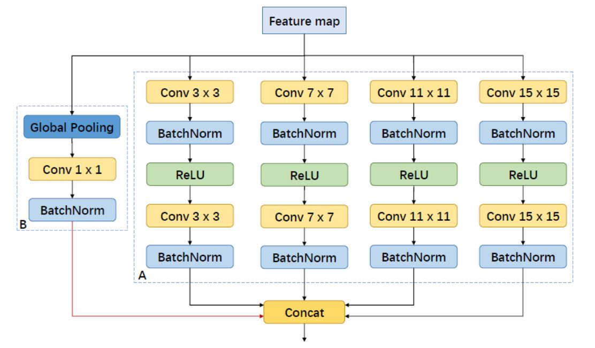
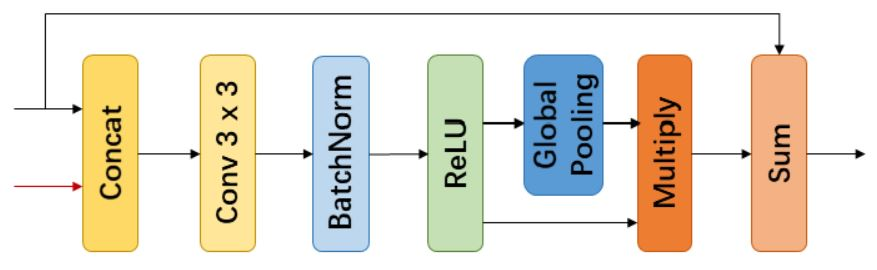
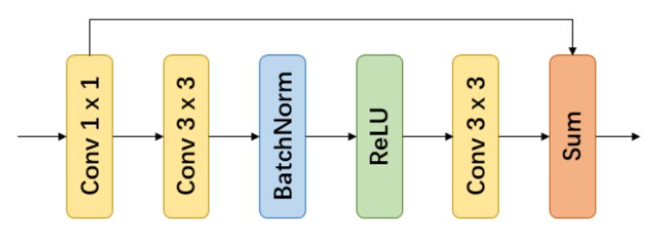
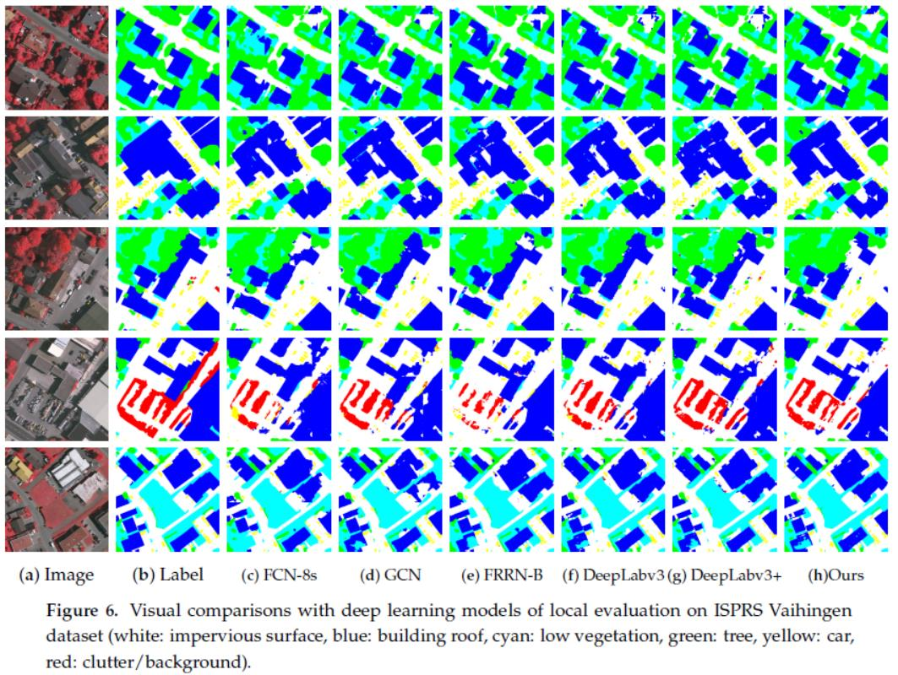
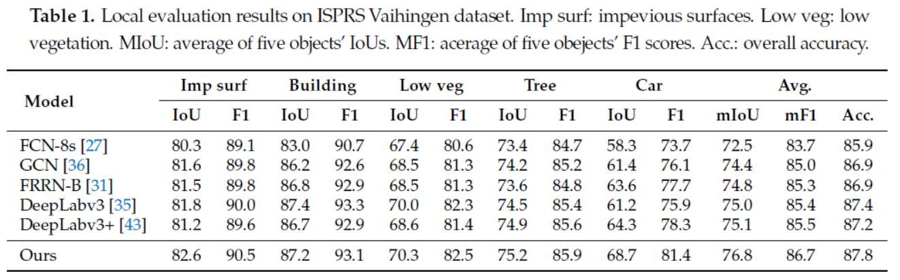
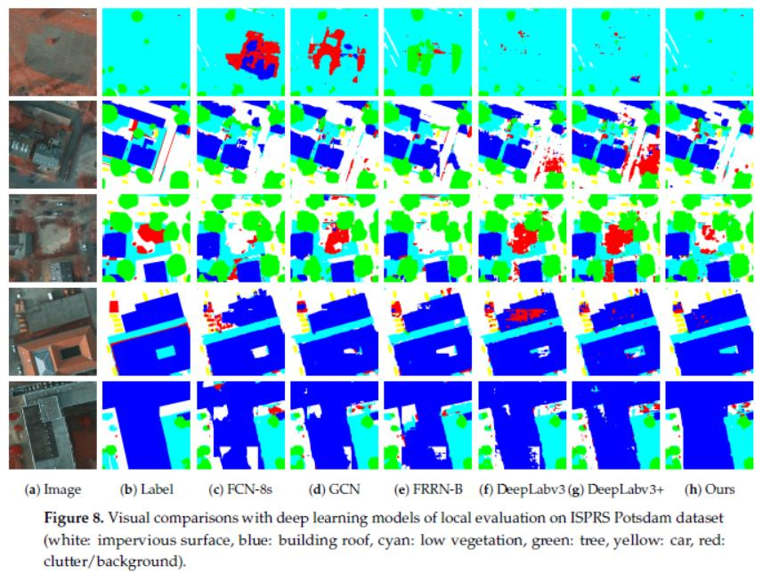
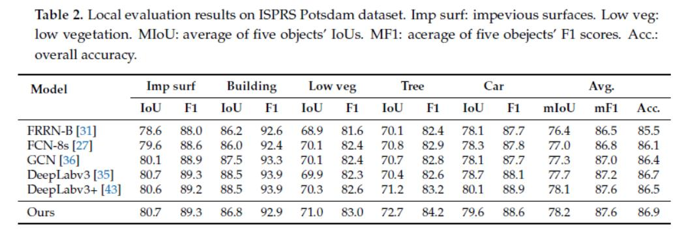

**摘要**：多尺度物体识别和物体的精确定位是基于CNN的高分辨率航拍图像中语义标注方法的两个主要难题。为了解决这些问题，作者设计了一个用于聚合多个尺度的上下文信息CFM模块，它由具有不同大小卷积核的并行卷积层和一个全局池化分支组成。同时，也提出了一个AMM模块，它利用通道方式的注意机制来组合多级功能，以获得更高的定位精度。最后，作者进一步采用残差卷积模块（RCM）来优化所有提取到的特征。基于这些模块，作者构建了一个用于航空图像中的语义标记的端到端网络CAN。并且在ISPRS Vaihingen和Potsdam数据集上的实验结果表明，CAN具有优秀的性能。

----

### 1、CAN提出的动机
&emsp;&emsp;CAN提出的动机有以下几种：<br>
&emsp;&emsp;1)由于连续的下采样操作，特征图尺寸大大减小，因此最终特征图的空间分辨率大大降低。这意味着信息的大量丢失，直接导致了最后的语义标记结果丢失了大量细节，并且看起来模糊不清。<br>
&emsp;&emsp;2)现有网络在捕获多尺度特征和识别复杂场景方面的能力很弱。因此，对于具有多个尺度的对象，它无法很好地识别它们。在航拍图像中，由于场景的大规模变化性、复杂性以及对象的精细结构等原因，这个问题更加严重。<br>
&emsp;&emsp;基于以上两个问题，作者做了如下工作：<br>
&emsp;&emsp;1）设计了一个Context Fuse模块(CFM)来广泛地利用上下文信息。它由具有不同大小卷积核的并行卷积层以及用于引入全局信息的全局池化分支组成。其中并行卷积层用于聚合具有多个感受野的上下文信息。<br>
&emsp;&emsp;2）提出了一个注意混合模块（AMM），它利用通道方式的注意机制来组合多级特征，并有选择地强调更具辨别力的特征以进行识别。并且在使用AMM前，进一步采用残差卷积模块（RCM）来优化特征。

----

### 2、CAN模型概述
&emsp;&emsp;如下图所示，CAN是一种类似于编码器-解码器[30] 的体系结构。ResNet因其强大的特征提取能力而被用作特征提取网络。对于ResNet中每个阶段的输出，它们通过RCM块进行特征适应和细化。然后，最后一层的特征图（包含丰富的高级语义信息）被输入CFM块以捕获和聚合多尺度特征。之后，通过AMM块组合在特征提取网络中的多个阶段中生成的不同级别的特征图。这些组合的特征由RCM块改进，然后网络输出最终的语义标记结果。<br><br>
<br>


#### 2.1、Context Fuse Module （CFM）
&emsp;&emsp;CFM主要由两部分组成，如下图所示：A部分是一个并行卷积块，包含4个具有不同大小卷积内核的分支。B部分是一个全局池化分支，用于引入全局上下文信息。<br><br>
<br><br>
&emsp;&emsp;**并行卷积块**  并行卷积块由4个具有不同大小的的卷积分支组成，即{3,7,11,15}。 每个分支具有两个卷积层以提取由特征提取网络生成的特征。同时在每一个分支的第一个卷积操作后使用批归一化来减少内部协变量偏移并使用ReLU作为激活函数。在各分支进行第二次卷积后，输出的结果只接入BN层而不使用激活函数。与DeepLabv3中的ASPP不同，这里使用常规卷积层（实心内核），而不是空洞卷积层（零填充内核）。 通过这种方式，可以防止特征图具有网格效果并获得更一致的结果。对于每个卷积分支提取的特征，我们将它们连接在一起以融合具有不同感知域的特征。<br>
&emsp;&emsp;至于卷积核大小，最大的是15×15卷积核。原因是ResNet网的最后一个卷积层输出的是输入图像1/32大小的特征映射。这里的输入图像大小是512×512，最后一个特征映射大小是16×16.然后这个15 ×15卷积分支便可以成为全局卷积。这增加了网络识别复杂对象的能力。另外，可以根据输入图像大小调整内核大小。值得一提的是，由于最后的特征映射很小，这些大的核卷积层只会增加很小的额外计算成本。<br>
&emsp;&emsp;**全局池化分支** 采用全球平均池化来引入全局信息。在此分支中，特征图通过全局平均池层来捕获全局上下文，然后通过1×1卷积层执行通道缩减。然后对最终特征图进行上采样并与并行卷积块输出连接。
&emsp;&emsp;总的来说，并行卷积块通过具有不同大小卷积核的卷积层聚合多尺度信息，全局池化分支捕获全局上下文信息。因此，CFM块生成了包含多尺度信息和全局上下文信息的特征。

#### 2.2、Attention Mix Module（AAM）
&emsp;&emsp;为了获得更准确的位置信息，许多研究将浅层特征与深层特征相结合。FCN使用跳层连接将浅层特征添加到深层特征。U-Net逐步将浅层特征与深层特征连接起来进行特征融合。 DeepLabv3 +在一个浅层特征上进行通道缩减，并将其与一个深层连接。但是，这些研究要么直接对它们求和，要么将它们连接在一起，而不考虑通道之间的差异。因此，如下图所示，我们设计AMM模块以结合低级功能和高级功能。<br><br>
<br><br>
&emsp;&emsp;具体而言，AMM首先将低级特征和高级特征连接在一起，然后使用3×3卷积层来执行信道缩减。之后，使用全局平均池化将要素图缩小为1×1，并成为向量。向量作为通道的权重与其未池化前的特征相乘。通过这种方式，强调了具有更强判别力特征通道，并抑制较少的歧视性特征通道。最后，我们直接向它添加低级特征以执行显式融合，这使得该模块成为类似残差的结构，并与残余块具有相似的优点。因此，我们更加自适应地融合多级功能，并获得具有更高识别能力的功能。

#### 2.3、 Residual Convolutional Module（RCM）
&emsp;&emsp;这个结果受残差块的启发，并且更加的专注于特征的优化。它的结构如下图所示：<br><br>
<br><br>
&emsp;&emsp;RCM块由1个1×1卷积层和类似残差的块组成。 1×1卷积层将输出特征的通道数通一变换为512.剩余的3*3卷积单元执行特征的调整和细化。因此，我们认为这个模块也增强了网络的捕获复杂特征的能力。

----

### 3、实验
#### 3.1、 ISPRS Vaihingen数据集
<br><br>
<br><br>
#### 3.2、 Potsdam数据集
<br><br>
<br><br>

----

### 4、代码理解
&emsp;&emsp;代码的开源地址：https://github.com/Spritea/Context-Aggregation-Network/blob/master/ptsemseg/models/CAN.py<br>
&emsp;&emsp;我们以ResNet-18为特征提取网络的CAN-18模型进行理解。所涉及的类与函数包括：
> * *CAN* 类：对CAN模型进行构建的类；<br><br>
* *CAN18* 函数：实现加载Imagenet数据集上预训练参数的作用；<br><br>
* *CFM* 类：对CFM模型进行定义的类；<br><br>
* *RefineBlock* 类：对RCM进行定义的类；<br><br>
* *Bottleneck* 与 *BasicBlock* 类:两个ResNet常用的特征提取块；<br><br>
* *AMM* 类：对AMM模型进行定义的类；<br><br>
* *conv3x3_bn* 函数：封装了一个默认步长为1的3×3卷积操作，并在其后接入BN层；<br><br>
* *conv3x3* 与 *conv1x1* 函数：封装了一个默认步长为1的3×3卷积操作与默认步长为1的1×1卷积操作；<br><br>
* *maybe_download* 函数：在models_urls提供地址上下载Imagenet数据集上的预训练参数；<br><br>
* *models_urls*：Imagenet数据集上的预训练参数地址。

#### 4.1、CFM类
> * *\__init__*:初始化forword函数中所必须用到的卷积、池化操作；<br><br>
* *forward*:实现了并行卷积块各个分支的卷积操作以及全局池化操作。值得注意的是，在进行各分支连接前的各个卷积操作后都只接入BN层而不使用Relu激活。

```
class CFM(nn.Module):
    def __init__(self, in_channel, out_channel):
        super(CFM, self).__init__()

        self.c15_1 = nn.Conv2d(in_channel, out_channel, kernel_size=15, stride=1, padding=7, bias=False)
        self.c11_1 = nn.Conv2d(in_channel, out_channel, kernel_size=11, stride=1, padding=5, bias=False)
        self.c7_1 = nn.Conv2d(in_channel, out_channel, kernel_size=7, stride=1, padding=3, bias=False)
        self.c3_1 = nn.Conv2d(in_channel, out_channel, kernel_size=3, stride=1, padding=1, bias=False)

        self.c15_2 = nn.Conv2d(in_channel, out_channel, kernel_size=15, stride=1, padding=7, bias=False)
        self.c11_2 = nn.Conv2d(in_channel, out_channel, kernel_size=11, stride=1, padding=5, bias=False)
        self.c7_2 = nn.Conv2d(in_channel, out_channel, kernel_size=7, stride=1, padding=3, bias=False)
        self.c3_2 = nn.Conv2d(in_channel, out_channel, kernel_size=3, stride=1, padding=1, bias=False)

        self.avg_pool = nn.AdaptiveAvgPool2d(1)
        self.c1_gpb = nn.Conv2d(in_channel, out_channel, kernel_size=1, bias=False)

        self.bn = nn.BatchNorm2d(out_channel)
        self.relu = nn.ReLU(inplace=True)

    def forward(self, x):
        # -----------------获取输入图像的分辨率---------------------#
        input_size = x.size()[2:]
        # ----------------------------------------------------------#

        #-----------------卷积核为15×15的分支----------------------#
        x15_1 = self.c15_1(x)
        x15_1 = self.bn(x15_1)
        x15_1 = self.relu(x15_1)
        x15_2 = self.c15_2(x15_1)
        x15_2 = self.bn(x15_2)
        # ----------------------------------------------------------#

        # -----------------卷积核为11×11的分支----------------------#
        x11_1 = self.c11_1(x)
        x11_1 = self.bn(x11_1)
        x11_1 = self.relu(x11_1)
        x11_2 = self.c11_2(x11_1)
        x11_2 = self.bn(x11_2)
        # ----------------------------------------------------------#

        # -----------------卷积核为7×7的分支----------------------#
        x7_1 = self.c7_1(x)
        x7_1 = self.bn(x7_1)
        x7_1 = self.relu(x7_1)
        x7_2 = self.c7_2(x7_1)
        x7_2 = self.bn(x7_2)
        # ----------------------------------------------------------#

        # -----------------卷积核为3×3的分支----------------------#
        x3_1 = self.c3_1(x)
        x3_1 = self.bn(x3_1)
        x3_1 = self.relu(x3_1)
        x3_2 = self.c3_2(x3_1)
        x3_2 = self.bn(x3_2)
        # ----------------------------------------------------------#

        # -----------------全局池化分支的分支----------------------#
        x_gp = self.avg_pool(x)
        x_gp = self.c1_gpb(x_gp)
        x_gp = self.bn(x_gp)
        x_gp = F.upsample(x_gp, size=input_size, mode='bilinear')
        # ----------------------------------------------------------#

        # ------------------------连接各个分支----------------------#
        out = torch.cat([x_gp, x15_2, x11_2, x7_2, x3_2], dim=1)
        # ----------------------------------------------------------#

        return out


```
#### 4.2、AMM类
> * *\__init__*:初始化forword函数中所必须用到的卷积、池化操作；<br><br>
* *forward*:首先将低分辨率的输入做上采样，使其分辨率与高分变率表示一致。然后将二者进行连接（
torch.cat）操作。随后将结果送入1×1的卷积中进行特征的优化与调整，其结果接入BN层与Relu函数。经过Relu处理后对其进行全局平均池化得到各个通道的权重。将权重与自身相乘，随后将相乘的结果与原始高分辨率输入求和得到最后的输出。
```
class AMM(nn.Module):
    def __init__(self, in_size, out_size):
        super(AMM, self).__init__()
        self.in_size = in_size
        self.out_size = out_size
        self.conv = nn.Conv2d(in_size*2, out_size, kernel_size=1, stride=1, bias=False)
        self.avg_pool = nn.AdaptiveAvgPool2d(1)
        self.bn=nn.BatchNorm2d(in_size)
        self.relu=nn.ReLU(inplace=True)

    def forward(self, input_low, input_high):
        # -----------------高低分辨率输入的连接----------------------#
        high_size = input_high.size()[2:]
        # low channel usually > high channel
        # if self.in_size != self.out_size:
        #     input_low = self.conv(input_low)
        upsample_low = F.upsample(input_low, high_size, mode='bilinear')
        input_cat = torch.cat([upsample_low, input_high], dim=1)
        # ----------------------------------------------------------#

        # -----------------卷积、BN、Relu---------------------#
        input_cat=self.conv(input_cat)
        input_cat=self.bn(input_cat)
        input_cat=self.relu(input_cat)
        # ----------------------------------------------------------#

        # -----------------通道注意机制-----------------------------#
        gp = self.avg_pool(input_cat)
        multiply=gp*input_cat
        # ----------------------------------------------------------#

        # -----------------与高分辨率输入求和-----------------------#
        # out=multiply+input_cat
        out = multiply + input_high
        # ----------------------------------------------------------#
        return out


#### 4.3、RefineBlock类

> 这里值得注意的是最开始的1×1卷积后的输出的结果通道数都为512。同时最后一个3×3卷积后的结果直接与原始输入求和而不再接入BN层与Relu函数做处理。


```
class RefineBlock(nn.Module):
    def __init__(self, in_channel):
        super(RefineBlock, self).__init__()
        self.c1 = nn.Conv2d(in_channel, 512, kernel_size=1, stride=1, padding=0, bias=False)
        self.c3_1 = nn.Conv2d(512, 512, kernel_size=3, stride=1, padding=1, bias=False)
        self.bn = nn.BatchNorm2d(512)
        self.relu = nn.ReLU(inplace=True)
        self.c3_2 = nn.Conv2d(512, 512, kernel_size=3, stride=1, padding=1, bias=False)

    def forward(self, x):
        x1 = self.c1(x)
        x = self.c3_1(x1)
        x = self.bn(x)
        x = self.relu(x)
        x = self.c3_2(x)
        out = x1 + x

        return out
```

#### 5.3、CAN类
> * *\__init__*:初始化forword函数中所必须用到的卷积、池化等操作；<br><br>
* *forward*:是对CAN模型整个业务逻辑（在本文第2节中有明确的阐述）的定义。<br><br>
*\_make_layer*:使用ResNet的Basicblock或者bottleblock作为特征提取块得到由浅入深的4层特征。

```
class CAN(nn.Module):

    def __init__(self, block, layers, num_classes=1000):
        super(CAN, self).__init__()
        # self.do = nn.Dropout(p=0.5)

        self.inplanes = 64
        self.conv1 = nn.Conv2d(3, 64, kernel_size=7, stride=2, padding=3,
                               bias=False)
        self.bn1 = nn.BatchNorm2d(64)
        self.relu = nn.ReLU(inplace=True)
        self.maxpool = nn.MaxPool2d(kernel_size=3, stride=2, padding=1)
        self.layer1 = self._make_layer(block, 64, layers[0])
        self.rb1_1 = RefineBlock(256)
        self.layer2 = self._make_layer(block, 128, layers[1], stride=2)
        self.rb2_1 = RefineBlock(512)
        self.layer3 = self._make_layer(block, 256, layers[2], stride=2)
        self.rb3_1 = RefineBlock(1024)
        self.layer4 = self._make_layer(block, 512, layers[3], stride=2)
        self.rb4_1 = RefineBlock(2048)
        # self.avgpool = nn.AdaptiveAvgPool2d((1, 1))
        # self.fc = nn.Linear(512 * block.expansion, num_classes)
        # only for >=res50

        # self.CFM=CFM(2048,512)
        self.CFM = CFM(512, 512)
        self.rb4_2 = RefineBlock(512 * 5)

        self.fuse43 = AMM(512, 512)
        # self.post_proc43 = conv3x3_bn(512*2,512)
        self.rb3_2 = RefineBlock(512)
        self.fuse32 = AMM(512, 512)
        self.rb2_2 = RefineBlock(512)
        # self.post_proc32 = conv3x3_bn(512)
        self.fuse21 = AMM(512, 512)
        self.rb1_2 = RefineBlock(512)
        # self.post_proc21 = conv3x3_bn(512)

        self.class_conv = nn.Conv2d(512, num_classes, kernel_size=3, stride=1,
                                    padding=1, bias=True)

    def _make_layer(self, block, planes, blocks, stride=1):
        downsample = None
        if stride != 1 or self.inplanes != planes * block.expansion:
            downsample = nn.Sequential(
                conv1x1(self.inplanes, planes * block.expansion, stride),
                nn.BatchNorm2d(planes * block.expansion),
            )

        layers = []
        layers.append(block(self.inplanes, planes, stride, downsample))
        self.inplanes = planes * block.expansion
        for _ in range(1, blocks):
            layers.append(block(self.inplanes, planes))

        return nn.Sequential(*layers)

    def forward(self, x):
        ori_size = x.size()[2:]
        # ----------------------------卷积操作----------------------#
        x = self.conv1(x)
        x = self.bn1(x)
        x = self.relu(x)
        x = self.maxpool(x)
        # ----------------------------------------------------------#

        # -----------------------ResNet提取特征----------------------#
        l1 = self.layer1(x)
        l2 = self.layer2(l1)
        l3 = self.layer3(l2)
        l4 = self.layer4(l3)
        # ----------------------------------------------------------#

        # ---------------------RCM模块优化特征----------------------#
        l1 = self.rb1_1(l1)
        l2 = self.rb2_1(l2)
        l3 = self.rb3_1(l3)
        l4 = self.rb4_1(l4)
        # ----------------------------------------------------------#

        # -----------------CFM模块提取上下文信息--------------------#
        l4 = self.CFM(l4)
        l4 = self.rb4_2(l4)
        # ----------------------------------------------------------#

        # -----------------AAM模块进行上采样的融合------------------#
        x_fuse43 = self.fuse43(l4, l3)
        x_fuse43 = self.rb3_2(x_fuse43)
        x_fuse32 = self.fuse32(x_fuse43, l2)
        x_fuse32 = self.rb2_2(x_fuse32)
        x_fuse21 = self.fuse21(x_fuse32, l1)
        x_fuse21 = self.rb1_2(x_fuse21)
        # ----------------------------------------------------------#

        # --------------------------上采样输出----------------------#
        # x_fuse21=self.do(x_fuse21)
        x = self.class_conv(x_fuse21)
        x = F.upsample(x, ori_size, mode='bilinear')
        # ----------------------------------------------------------#
        return x
```

----

### 6、总结
&emsp;&emsp;CAN具有类似于编码器的解码器(实质上我认为它就是优化了上下文提取机制与特征融合机制的U-Net)，具有高效的上下文信息聚合和基于注意力的多级特征融合。它由上下文融合模块（CFM），注意混合模块（AMM）和残余卷积模块（RCM）组成。 CFM由具有不同大小卷积核的并行卷积层和全局池化分支组成。并行卷积层将上下文信息与多个感知域聚合在一起。全局池化分支则引入了全局上下文信息。AMM利用通道智能注意机制来组合多级特征，并有选择地强调更具辨别力的特征。RCM改进了所有特征级别的特征。通过这些模块，CAN可以更有效地组合多级功能，并更广泛地利用功能。
