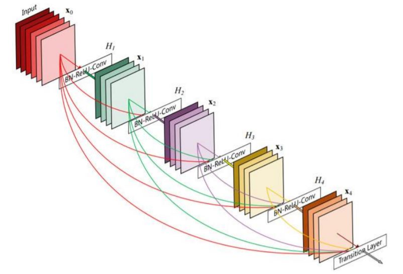
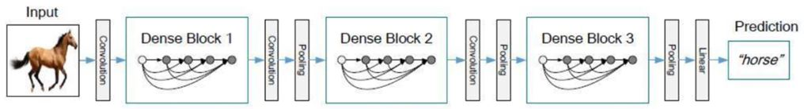
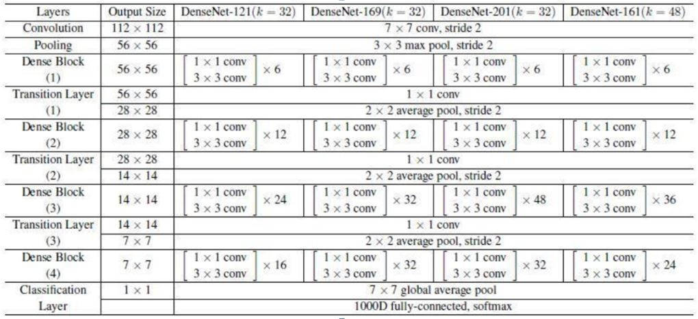
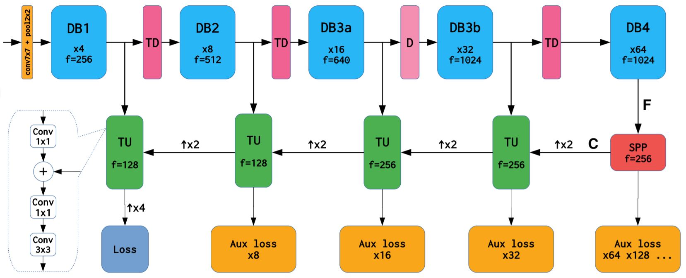
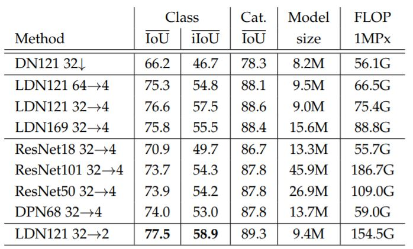
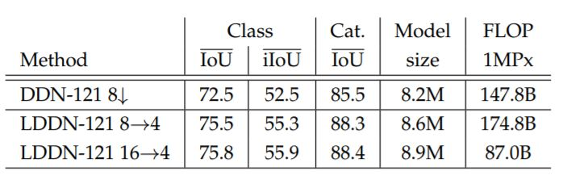
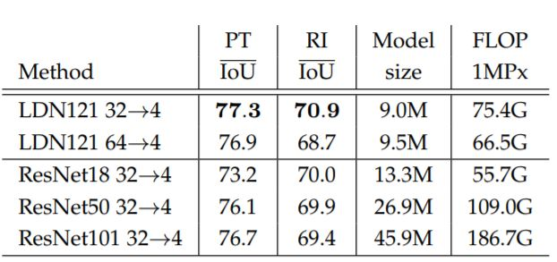
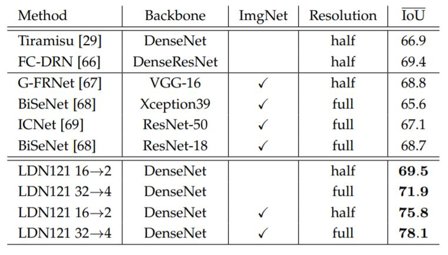
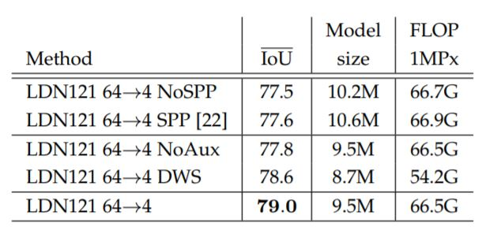

**摘要**：GPU内存的大小是影响语义分割效率的一个重要因素。目前，正常内存大小的GPU，在对大分辨率图像大小进行分割时，如何支持卷积反向传播所需的特征图的高速缓存是一个重大挑战（即使对于中等分辨率大小的Pascal图像也是如此）。DenseNet被提了出来用于解决这一问题。但是由于目前主流的深度学习编程框架没有很好的算法支持，导致DenseNet在进行语义分割时所需要的内存以及分割的效率与ResNet差别不大。为了解决这一问题，作者基于DenseNets精细的设计了Efficient Ladder style DenseNets模型。在该模型中：1）对 DenseNet 进行了详尽的研究；2）提出阶梯式上采样路径，将深层特征的语义与早期层的位置精度相结合，并且不需要大量的计算资源；3）支持在反向传播期间积极地重新计算中间激活，通过Gradient checkpointing减少与反向传播相关的缓存的大小。最终的模型，在Citycapes、CamVid、Pascal VOC 2012等数据集上取得了优秀的分割结果。

----
### 1、DenseNet
#### 1.1、Dense block
&emsp;&emsp;DenseNet 是 CVPR 2017 最佳论文之一。最近一两年卷积神经网络提高效果的方向，一方面是使得网络的深度加深（比如 ResNET，通过残差块解决了网络加深时候的梯度消失问题从而使得网络得以发展到数百层之深），另一方面试扩宽网络（比如 GoogleNet 的 Inception模块），而DenseNet的作者则是从特征入手，通过对特征的极致利用达到更好的效果和更少的参数。 
&emsp;&emsp;先放一个 DenseNet block 的基本构造，对其有一个整体的感知。如下图：在该网络中，任何两层之间都有直接的连接，也就是说，网络每一层的输入都是前面所有层输出的并集，而该层所学习的特征图也会被直接传给其后面所有层作为输入。  
  
&emsp;&emsp;如果记第 l 层的变换函数为Hi（通常对应于一组或两组3*3 卷积、批归一化、ReLU
操作），输出为 xi，那么每一层的 DenseNet 的操作可以由如下方式表示：

x𝑖 = 𝐻𝑖 (x0, x1, … , x𝑖−1 )
 
&emsp;&emsp;这个方式十分容易理解以及实现。
#### 1.1、Dense block
&emsp;&emsp;将3个Dense block搭建在一起便形成了DenseNet。下面是 DenseNet 的整个框架图以及具体的实现细节：  
  
  
> * 每一个Dense block中的卷积操作最后产生的特征图的通道数(channel)是一个固定值，称为增长率，并由超参数k定义。
* Dense Block 结束后的输出 channel个数很多，需要用1×1 的卷积核来降维。Transition Layer 中经 1×1 卷积后输出的通道数与输入之比称为压缩率（theta）。
* bottleneck与transition layer：在每个 Dense Block 中都包含很多个子结构，以 DenseNet-169 的 Dense Block（3）为例，它包含 32 个 1×1 （在3×3卷积前加上1×1卷积即为bottleneck）和 3×3 的卷积操作，也就是第 32 个子结构的输入是前面 31 层的输出结果，每层输出的 channel 是 32（增长率k），那么如果不做bottleneck 操作，第 32 层的 3×3 卷积操作的输入就是 3×3+（上一个 Dense Block的输出 channel），近 1000 了。而加上 1×1  的卷积，经过 1×1 卷积后的 channel是 growth rate×4，也就是 128，然后再作为 3×3 卷积的输入。这就大大减少了计算量，这就是bottleneck。至于 transition layer，放在两个 Dense Block 中间，是因为每个 Dense Block 结束后的输出 channel 个数很多，需要用 1×1 的卷积核来降维。还是以 DenseNet-169 的 Dense Block（3）为例，虽然第 32 层的 3*3 卷积输出 channel 只有 32 个（增长率k），但是紧接着还会像前面几层一样有通道的 concat 操作，即将第 32 层的输出和第 32 层的输入做 concat，前面说过第 32层的输入是 1000 左右的 channel，所以最后每个 Dense Block 的输出也是 1000 多的 channel。因此这个 transition layer 有个参数 压缩率（范围是 0 到 1），表示将这些输出缩小到原来的多少倍，默认是 0.5，这样传给下一个 Dense Block 的时候 channel 数量就会减少一半，这就是 transition layer 的作用。
* 另外，包含 bottleneck layer（dense block 的 3*3 卷积前面都包含了一个 1*1
的卷积操作，就是所谓的bottleneck layer）的叫DenseNet-B，包含压缩层（transition
layer）的叫 DenseNet-C，两者都包含的叫 DenseNet-BC。

&emsp;&emsp;DenseNet 的想法很大程度上源于在 ECCV 上的一个叫做随机深度网（Deep
networks with stochastic depth）工作。当时提出了一种类似于 Dropout 的方法来改进 ResNet。我们发现在训练过程中的每一步都随机地「扔掉」（drop）一些层，可以显著的提高 ResNet 的泛化性能。这个方法的成功至少带给我们两点启发： 
&emsp;&emsp;首先，它说明了神经网络其实并不一定要是一个递进层级结构，也就是说网络中的某一层可以不仅仅依赖于紧邻的上一层的特征，而可以依赖于更前面层学习的特征。想像一下在随机深度网络中，当第 l 层被扔掉之后，第 l+1 层就被直接连到了第 l-1 层；当第 2 到了第 l 层都被扔掉之后，第 l+1 层就直接用到了第 1 层的特征。因此，随机深度网络其实可以看成一个具有随机密集连接的DenseNet。 
&emsp;&emsp;其次，我们在训练的过程中随机扔掉很多层也不会破坏算法的收敛，说明了ResNet 具有比较明显的冗余性，网络中的每一层都只提取了很少的特征（即所谓的残差）。实际上，我们将训练好的 ResNet 随机的去掉几层，对网络的预测结果也不会产生太大的影响。 
&emsp;&emsp;DenseNet 的设计正是基于以上两点观察。我们让网络中的每一层都直接与
其前面层相连，实现特征的重复利用；同时把网络的每一层设计得特别「窄」，即只学习非常少的特征图（最极端情况就是每一层只学习一个特征图），达到降低冗余性的目的。这两点也是 DenseNet 与其他网络最主要的不同。需要强调的是，第一点是第二点的前提，没有密集连接，我们是不可能把网络设计得太窄的，否则训练会出现欠拟合（under-fitting）现象，即使 ResNet 也是如此。

----
### 2、Efficient Ladder style DenseNets方法概述
#### 2.1、Efficient Ladder style DenseNets的提出动机
&emsp;&emsp;我认为Efficient Ladder style DenseNets的提出动机有如下几点： 
&emsp;&emsp;1)虽然相比于ResNet，DenseNet-BC的整体参数量变得更少，同时其整体提取特征的效果相对于ResNet有了提升。但是，由于缺少好的实现方式，导致在运行模型时，DenseNet-BC的内存占用非常高。这种现象对于实现大分辨率的图像语义分割任务是十分不利的。 
&emsp;&emsp;2）目前上采样路径上采用的恢复低分辨率表示的低级特征的方法仍然有提升空间。为了进一步的提高高分辨率的低级特征与低分辨率的高级特征之间融合对恢复低分辨率表示的空间细节信息的效。
#### 2.2、Efficient Ladder style DenseNets整体框架
&emsp;&emsp;下图是作者所提出来的Efficient Ladder style DenseNets模型（以下简称LDN）的整体框架：
  
&emsp;&emsp;LDN由两条平行的下采样路径与上采样数据路径组成。下采样路径由两个原始Dense block、一个中间插入池化层D的Dense block（这扩大了DB3a之后所有卷积的感受域，同时降低了它们的计算复杂度。与扩张卷积[23]相比，这种方法降低了空间分辨率（后来通过梯形混合恢复），以提高执行速度和减少内存占用）和轻量级空间金字塔池模块（SPP）组成。Dense block通过逐渐降低空间分辨率并增加特征图的数量，最终将输入的数据转换为特征张量F。SPP模块使用由Dense block提取到的上下文信息丰富特征并创建上下文感知特征C。上采样数据路径将低分辨率特征C转换为高分辨率语义预测。这种转换是通过将来自较深层的语义与来自早期层的精细细节有效地混合来实现的（阶梯式上采样路径）。
#### 2.3、阶梯式上采样路径
&emsp;&emsp;上采样路径的作用是恢复由于下采样而丢失的细节。所提出的设计基于简约转换（TU）块。 TU块的目标是混合两个空间分辨率相差2倍的分辨率表示。较小的分辨率表示来自上采样数据路径，而较大的分辨率表示来自下采样数据路径。首先使用双线性插值对较小的分辨率表示进行上采样，以使两个表示具有相同的分辨率。随后，将较大的表示投影到较低维空间，以使两个表示具有相同数量的特征图（channels相等）。TU块平衡了两个数据路径的相对影响，并通过跳层连接从而进行简单求和来混合两个分辨率表示。随后，应用1×1卷积来减少维数（如果需要），并以3×3卷积结束而获得输入到输入到下一个TU块的分辨率表示以及当前TU块获得的Aux Loss。沿着上采样数据路径递归地重复TU块。最终的TU块在通过上采样获得与原始输入图像分辨率一致的特征图，并可求得最后的Loss。 
> ## 我大胆的假设TU块的有效性在于在数据融合前使用到了1×1的卷积，这有待于我进一步的使用消融实验去证实这一猜想。

#### 2.4、Gradient checkpointing（梯度检查点）
&emsp;&emsp;语义分割在训练期间需要非常大量的内存，尤其是在大输入分辨率时。由于GPU RAM的严格限制，这些要求可能导致困难。但是，小型训练批次可能导致统计数据不稳定和学习成绩不佳。这是DenseNet在其竞争性上的严重障碍。 
&emsp;&emsp;使用梯度检查点可以减少与反向传播相关的缓存的大小。其主要思想是在前向传递时仅缓存所有激活中必须选择的子集。这些激活随后用于在反向传播期间重新计算非缓存激活。计算图的显式缓存节点称为梯度检查点。两个梯度检查点之间的子图称为检查点段。反向传递遍历所有检查点段并按如下方式处理它们：首先，从存储的检查点开始重新计算前向传递激活。其次，通过标准反向传递计算梯度。一旦处理了相应的段，即在继续到下一段之前，就释放本地高速缓存。 
&emsp;&emsp;必须注意到梯度检查点的长度会影响空间和时间效率。扩大检查点段总是会减少前向传递的内存占用量。但是，会增大反向传播时所需要的内存大小。较大的段需要单独使用更多内存，因为它们需要重新计算所有必需的激活并将它们存储在本地缓存中。当检查点段扩大到一定程度的时候，反向传播时增加的内存会超过前向传递时所减少的内存占用量。我们最好的检查点设置方法是仅保存3×3卷积的结果，因为它们是计算量最大的操作。换句话说，我们建议在反向传播期间重新计算骨干网络，所有映射，所有批归一化和所有连接。实验表明，这种方法在前向和后向传递中的最大内存分配之间取得了很好的平衡。 
&emsp;&emsp;所提出的检查点策略与论文《G. Pleiss, D. Chen, G. Huang, T. Li, L. van der Maaten, and K. Q.Weinberger, “Memory-efficient implementation of densenets,”CoRR, vol. abs/1707.06990, 2017》相关，后者将大量精力投入到共享存储的显式管理中。但是，这里我们展示了依靠标准的PyTorch内存管理器可以获得类似的结果。我们还展示了通过利用标准PyTorch模块torch.utils.checkpoint可以完全避免自定义反向传播操作。 最后，通过仅缓存3×3卷积的输出和输入图像来实现进一步的内存增益。我们通过检查骨干网络，过渡向下和过渡块以及整个DenseNet单元来实现这一目标。

----

### 3、实验
&emsp;&emsp;这是论文中对超参数设置以及使用到的符号的描述：
> * 我们使用AMSGrad来初始化训练我们的模型，初始学习率为0.0004。根据余弦学习率策略，在每一轮训练之后，学习率被减少。对于所有预先训练的权重，我们将学习率除以4。批量大小是优化过程的重要超参数。如果我们训练批量大小为1，那么批归一化统计数据恰好与我们正在训练的图像相匹配。由于跨越不同图像的大协变量移位，这阻碍了学习。我们通过对批量大小为16的随机裁剪进行训练来解决这个问题。在裁剪之前，我们应用随机翻转并使用0.5到2之间的随机因子重新缩放图像。裁剪大小设置为448,512或768，具体取决于分辨率数据集。如果裁剪恰好大于重新缩放的图像，则未定义的像素用平均像素填充。除非另有说明，否则我们训练300个轮次。我们在上采样路径上采用多个交叉熵损耗。
* 我们使用以下符号来描述我们在整个部分中的实验。 LDN代表Ladder DenseNet。符号d-> u表示下行路径，可将图像分辨率降低d次，梯形式上采样路径可产生相对于输入分辨率的u次采样预测。例如，LDN121 64-> 4表示图2中所示的模型。类似地，DDN和LDDN表示扩张的DenseNet，以及具有阶梯式上采样的扩张的DenseNet。符号d↓表示将图像分辨率降低d次并且没有上采样路径的模型。 MS表示5个等级（0.5,0.75,1,1.5和2）以及相应的水平翻转的多尺度评估。

#### 3.1、Citycapes
&emsp;&emsp;下表验证了几个流行的主干以及相同的SPP和上采样模块。由于硬件限制，我们在这里训练和评估半分辨率图像，并使用448×448裁剪。该表的第一部分介绍了DN121 32↓基线。第二部分介绍了我们的梯形式上采样模型。 LDN121 64->4模型的表现优于基线的IoU约10个百分点（pp）。由于与低级特征混合而导致更精细的输出分辨率，因此在小实例上会出现一些改进。其他改进发生在大型实例上，因为增加的二次取样（64对32）扩大了空间背景。请注意，由于语义边界的准确性更高，LDN121 32->4在此分辨率下略胜于LDN121 64->4。然而，由于较大的物体（需要较大的感受野）和逐个像素的注释误差，在全分辨率图像中的情况将相反。 LDN169 32->4型号具有更强的主干，但相对于LDN121 32->4略微恶化（0.8pp）。我们得出结论，半分辨率图像不包含足够的训练像素来支持DenseNet-169的容量。该第三部分证明残差和DPN基础提取块与DenseNet相比，泛化能力较差。底部显示进一步的上采样（LDN121 32->2）使计算复杂性增加一倍，同时仅带来轻微的精度提升。  
  
&emsp;&emsp;下表对比了扩张卷积之后通过上采样恢复分辨率损失的模型与LDN。 DDN-121 8↓模型在DenseNet块DB3和DB4之前移除跨步池化D，并在DB3（rate= 2）和DB4（rate= 4）中引入扩张。 SPP输出通过8次上采样恢复分辨率。通过对比我们产生logits并最终通过双线性上采样而恢复输入分辨率。 我们得出结论，扩张模型比LDN模型实现更差的泛化，同时需要更多的计算能力。  
  
#### 3.2、CamVid
&emsp;&emsp;下面第一个表显示了在全分辨率CamVid测试中的结果。结论类似于半分辨率Cityscapes 。由于他们类似的图像分辨率，我们并不感到惊讶。LDN121 32->4在预训练和随机初始化情况下均获胜，其中LDN121 64->4获得亚军第二个表将我们的最佳结果与CamVid测试的相关工作进行了比较，据我们所知，我们获得了最先进的结果。
  
  
##### 3.3、Pascal VOC 2012
&emsp;&emsp;下表显示，在没有COCO预训练的情况下，LDN实现了Pascal VOC 2012最新分割精度：  
  

----
### 4、总结
&emsp;&emsp;总的来说，LDN模型有效的利用Dense block做了特征提取，并提出了使用梯度检查点来进一步减少Dense block所带来的内存的激增。同时还对Dense block做了些许的改进——在第三个Dense block的中间插入了一个平均池化层。这增加了感受野，同时也减少了计算开销。另外，LDN创造性的提出了梯形上采样路径，这一想法在减少计算开销的同时，增加了低级特征与高级特征融合的效果。
