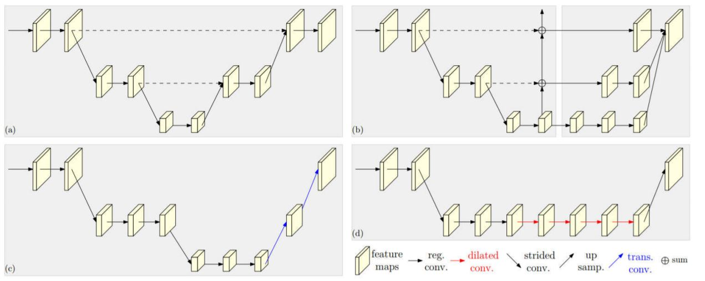
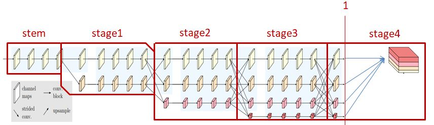
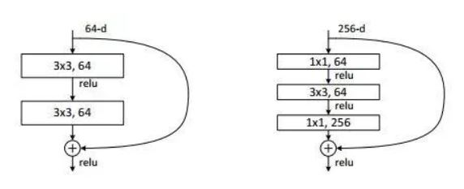

**摘要**：为了提高语义分割的精度，目前主流的趋势是先降低分辨率提取高级的语义特征，再采取多样的方法从低分辨率表示恢复到高分辨表示。在本文中则不然，HrNet V2在整个过程中都保持着高分辨率的表示。该模型分为先后五个阶段，第一阶段下采样到输入图像原有尺寸的1/4。随后，每一个阶段的开始添加从高分辨率通过下采样得到的低分辨率子网，结束前进行重复的多尺度融合，使得每一个分辨率可以重复的从其他分辨率获取信息。最后在第五阶段将所有的并行低分辨率子网的输出上采样到高分辨率子网的尺寸大小，然后通过连接所有的子网的表示获取到具有丰富信息的高分辨率表示。该模型在许多典型的语义分割数据集上都取得了更为精确的分割结果。

----

### 1、现有方法
&emsp;&emsp;计算最后的heatmap表示有两条主线。第一种是从网络（例如，ResNet）输出的低分辨率表示中恢复高分辨率表示，并且可选地恢复中间中等分辨率表示，例如Hourglass ，SegNet，DeconvNet，U-Net，和encoder-decoder。 另一个是通过高分辨率卷积保持高分辨率表示，并用并行的低分辨率卷积加强高分辨率表示。 此外，空洞卷积用于替换分类网络中的一些跨步卷积和相关的常规卷积，以计算中等分辨率表示。 
&emsp;&emsp;主线一的的典型方法包括以下4种： 
 
&emsp;&emsp;* a:对称结构。如U-Net等。先下采样，再上采样，使用跳层连接恢复下采样的信息。 
&emsp;&emsp;* b:级联金字塔。 
&emsp;&emsp;* c:先下采样，再使用转置卷积进行上采样。没有跳层连接 
&emsp;&emsp;* d:扩张卷积。增大感受野，在可以减少下采样的次数的同时直接可以不进行跳层连接而直接进行上采样 
&emsp;&emsp;本文正是沿着第二条主线进行的研究。高分辨率表示是在整个过程维持高分辨率，通常是通过将多分辨率（从高分辨率到低分辨率）并行卷积与并行卷积中的重复信息交换连接而形成的网络。代表作品包括GridNet ，卷积神经结构，相互连接的CNN ，以及最近开发的高分辨率网络（HRNet）。下面的将对在HrNet上做出很少修改，增加较小的计算开销，却较大的提升了分割准确度的HrNet V2做出详细的介绍。

### 2、HrNet V2方法概述
#### 2.1、HrNet V2框架
&emsp;&emsp;HrNet通过连接并行的不同分辨率表示和重复进行多尺度融合来维持高分辨率表示，由此产生的高分辨率表示不仅信息丰富而且空间精确。HrNet V2对HrNet进行了简单的修改。此修改增加了较小的开销，但是有着更强的高分辨率表示。如下图所示是HrNet V2的整体框架：
 
&emsp;&emsp;整个模块分为5个阶段：stem、stage1、stage2、stage3、stage4.在作者提供的开源代码中，将产生低分辨分支的功能以及重复的多尺度融合功能进行了分离，产生低分辨分支的功能在stage1、stage2、stage3阶段开头，重复的多尺度融合功能在stage1、stage2、stage3阶段的结尾。所以，在上图中，我将每一阶段的区分线画在了图中交叉线的中间。竖线1的左方是原始的HrNet表示。它直接输出stage3中的最上方的高分辨率表示，使其作为最后的heatmap。而HrNet V2则在其基础上添加了竖线1右边的部分。它首先将三个并行低分辨率子网的输出上采样到高分辨率子网的尺寸大小，然后通过简单的连接操作连接同样尺寸大小的四个分支的结果。最后将连接的结果通过1×1的卷积将通道数转变为语义分割的类别数目从而得到最后的结果。下面详细的介绍每一个阶段的具体处理步骤: 
&emsp;&emsp;1）**stem**。stem中完成的三个箭头代表着3个不同的处理。前两个处理使用步长为2的3×3卷积操作将输入图像卷积两次。从而使得图像的高（H）和宽（W）变为H/4与W/4的大小。随后的第三个处理使用4个Basicblock或者bottleblock进行处理，起到提取特征的作用。随后得到的输出（大小为[H/4，W/4，256]）被输入stage1中。 
&emsp;&emsp;2）**stage1**。首先在上一阶段的基础上产生一个低分辨率的分支。然后每一个分支分别利用4个Basicblock或者bottleblock进行特征提取。最后进行重复多尺度融合得到最后的输出。随后将得到的输出（大小分别为[H/4，W/4，32]，[H/8，W/8，64]）输入stage2中 
&emsp;&emsp;3）**stage2**。 首先在上一阶段的基础上产生一个低分辨率的分支。然后每一个分支分别利用4个Basicblock或者bottleblock进行特征提取。最后进行重复多尺度融合得到最后的输出。随后将得到的输出（大小分别为[H/4，W/4，32]，[H/8，W/8，64]，[H/16，W/16，128]）输入stage3中 
&emsp;&emsp;4）**stage3**。首先在上一阶段的基础上产生一个低分辨率的分支。然后每一个分支分别利用4个Basicblock或者bottleblock进行特征提取。最后进行重复多尺度融合得到最后的输出。随后将得到的输出（大小分别为[H/4，W/4，32]，[H/8，W/8，64]，[H/16，W/16，128]，[H/32，W/32，256]）输入stage3中 
&emsp;&emsp;5）**stage4**。这个阶段的功能在本节开始时已经介绍，这里不加赘述
#### 2.2、重复的多尺度融合
&emsp;&emsp;我们以stage2阶段最后进行的重复多尺度融合融合为例进行介绍。其他阶段的多尺度融合原理与其一致。在stage2进行重复多尺度融合前，存在3个不同分辨率表示的分支。所以，该阶段的多尺度融合如下图所示，需要3个步骤：
 
&emsp;&emsp;图中左边进行的处理是：首先将两个低分辨率表示的分支通过1×1的卷积变换到高分辨率同样的通道数。然后进行上采样，使得两个低分辨率表示的尺寸大小与高分辨率表示一致（H/4,W/4）。最后后，将三个不同分辨率表示求和得到了最后融合后的高分辨率表示。 
&emsp;&emsp;图中中间进行的处理是：首先将高分辨率表示的分支通过步长为2的3×3的卷积变换到与中间分辨率表示的尺寸（H/8,W/8）与通道数一样大小。然后，将先后通过1×1卷积与上采样操作将最低分辨率表示同样调整到中间分辨率表示的尺寸与通道数一样大小。最后，将三个不同分辨率表示求和得到了最后融合后的中间分辨率表示。 
&emsp;&emsp;图中右边进行的处理是：首先将两个高分辨率表示的分支通过步长为2的3×3的卷积变换到与最低分辨率表示的尺寸（H/16,W/16）与通道数一样大小。最后，将三个不同分辨率表示求和得到了最后融合后的最低分辨率表示。
### 3、代码详解(代码开源地址：https://github.com/HRNet/HRNet-Semantic-Segmentation)
#### 3.1、代码整体感知
&emsp;&emsp;开源代码的整体结构如图所示：
 
&emsp;&emsp;其中模型的编写以及超参数的设置分别存放于lib/models/seg_hrnet.py与lib/config/models.py中。seg_hrnet.py中包括Blockblock、bottleblock、HighResolutionModule、HighResolutionNet四个类以及一个封装好的名为conv3x3的函数用于3*3的卷积。其中HighResolutionNet定义了整个HrNet V2模块。HighResolutionModule是HighResolutionNet要调用的多尺度特征融合的模型。Blockblock、bottleblock是两个提取特征的模块。
#### 3.2、Basic block与bottle block
&emsp;&emsp;这两个模块是HrNet V2中要用到的特征提取模块。它们都是ResNet网络中所用到的经典的残差模块。 
 
&emsp;&emsp;Basic block模块搭建结构如上图左边所示：
>* 每一个3×3的卷积后都连接BN层进行批归一化； 
* 进入残差连接前的3×3的卷积后只接入BN层而不使用Relu函数，避免求和之后的特征都为正数，保持了特征的多样化； 
* 跳层连接：1）当模块输入的通道数与经过卷积处理后的特征向量通道数一致时，直接相加；2）当通道不一致时（一般发生于通道分辨率降低之后，同分辨率通道数一般一致），需要使用1×1的卷积（stride=2，使得分辨率降低）对原始输入数据进行处理，使其通道数与尺寸大小即分辨率经过两次3×3卷积处理后的残差支路特征一致。随后接入BN层，处理后不用ReLU而直接与残差支路特征求和。 

    class BasicBlock(nn.Module):
        expansion = 1

        def __init__(self, inplanes, planes, stride=1, downsample=None):
            super(BasicBlock, self).__init__()
            self.conv1 = conv3x3(inplanes, planes, stride)
            self.bn1 = BatchNorm2d(planes, momentum=BN_MOMENTUM)
            self.relu = nn.ReLU(inplace=False)
            self.conv2 = conv3x3(planes, planes)
            self.bn2 = BatchNorm2d(planes, momentum=BN_MOMENTUM)
            self.downsample = downsample
            self.stride = stride

        def forward(self, x):
            residual = x

            out = self.conv1(x)
            out = self.bn1(out)
            out = self.relu(out)

            out = self.conv2(out)
            out = self.bn2(out)

            if self.downsample is not None:
                residual = self.downsample(x)

            out = out + residual
            out = self.relu(out)

            return out

&emsp;&emsp;Basic block模块搭建结构如上图右边所示：
>* 首先使用1×1的卷积降低通道数从而减少计算开销，再使用3×3的卷积进行特征提取，最后再使用1×1的卷积恢复通道数； 
* 每一个卷积后都要接入BN层； 
* 进入残差连接前的1×1的卷积后只接入BN层而不使用Relu函数，避免求和之后的特征都为正数，保持了特征的多样化； 
跳层连接：1）当模块输入的通道数与经过卷积处理后的特征向量通道数一致时，直接相加；2）当通道不一致时（一般发生于通道分辨率降低之后，同分辨率通道数一般一致），需要使用1×1的卷积（stride=2，使得分辨率降低）对原始输入数据进行处理，使其通道数与尺寸大小即分辨率经过1×1，3×3，1×1卷积处理后的残差支路特征一致。随后接入BN层，处理后不用ReLU而直接与残差支路特征求和。 

    class Bottleneck(nn.Module):
        expansion = 4

        def __init__(self, inplanes, planes, stride=1, downsample=None):
            super(Bottleneck, self).__init__()
            self.conv1 = nn.Conv2d(inplanes, planes, kernel_size=1, bias=False)
            self.bn1 = BatchNorm2d(planes, momentum=BN_MOMENTUM)
            self.conv2 = nn.Conv2d(planes, planes, kernel_size=3, stride=stride,
                                   padding=1, bias=False)
            self.bn2 = BatchNorm2d(planes, momentum=BN_MOMENTUM)
            self.conv3 = nn.Conv2d(planes, planes * self.expansion, kernel_size=1,
                                   bias=False)
            self.bn3 = BatchNorm2d(planes * self.expansion,
                                   momentum=BN_MOMENTUM)
            self.relu = nn.ReLU(inplace=False)
            self.downsample = downsample
            self.stride = stride

        def forward(self, x):
            residual = x

            out = self.conv1(x)
            out = self.bn1(out)
            out = self.relu(out)

            out = self.conv2(out)
            out = self.bn2(out)
            out = self.relu(out)

            out = self.conv3(out)
            out = self.bn3(out)

            if self.downsample is not None:
                residual = self.downsample(x)

            out = out + residual
            out = self.relu(out)

            return out

#### 3.3、HighResolutionModule

### 4、总结
