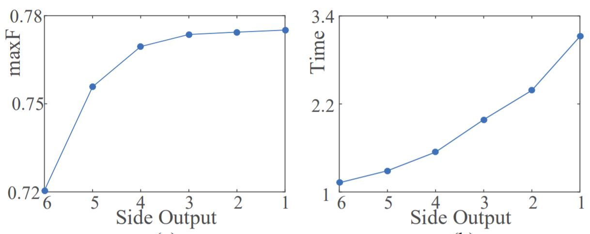
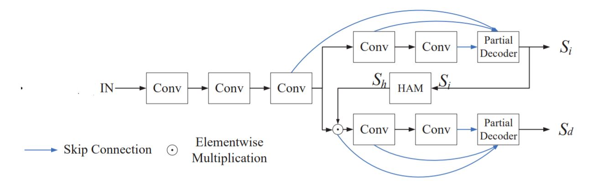
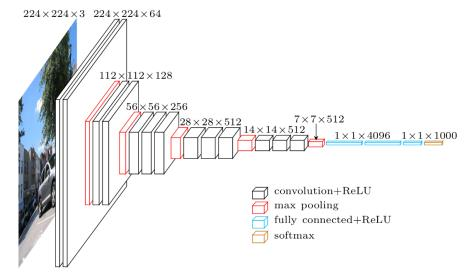
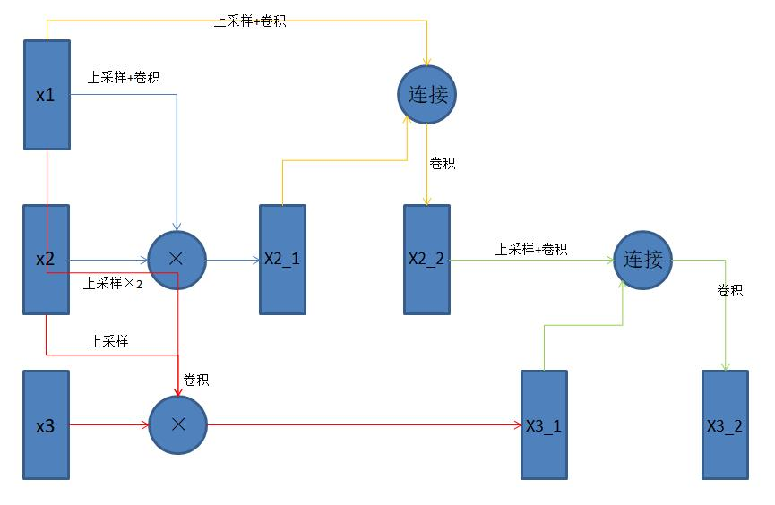

**摘要**：显著性检测依靠聚合卷积神经网络提取的多级特征而实现了其优越的性能。但是与高级特征相比，低级特征对显著性检测的性能的贡献较小。并且由于其较大的空间分辨率而需要更多的计算。在本文中，作者提出了一种新颖的部分级联解码器（CPD）框架，用于快速准确的显著性目标检测。一方面，该框架构造了部分解码器。它丢弃较浅层的较大分辨率特征以用于加速。另一方面，观察到整合更深层的特征会获得相对精确的特征图。因此，作者直接利用生成的特征图来细化特征提取骨干网络的特征。该策略有效地抑制了特征中的干扰因素，并显著的提高了它们的表示能力。在五个基准数据集上进行的实验表明，所提出的模型不仅实现了最先进的性能，而且比现有模型运行得更快。此外，CPD进一步应用于改进现有的多级特征聚合模型，可以显著的提高了其效率和准确性。

----
### 1.提出动机
&emsp;&emsp;我认为下图是该论文提出的根本动力：<br><br>
<br><br>
&emsp;&emsp;很明显，当从高级到低级逐渐聚合特征时，性能趋于快速饱和。另一方面，由于低级特征的大分辨率，将它们与高级特征相结合显然会增加计算复杂度。所以上图才会出现在逐渐融合低级特征时，max F-measure得分趋于缓慢增长，而所需要的时间则快速增加。但是，由于检测和分割显著性目标通常是更复杂操作的预处理阶段，所以这一过程应该运算速度应该很快。因此，必须设计一种机制来消除低级特征对计算复杂性的影响，同时确保性能。
### 2.CPD概述
&emsp;&emsp;在本文中，作者提出了一种新的级联部分解码器框架，它丢弃较浅层的特征，以确保较高的计算效率，然后细化更深层的特征，以提高其表示能力。CPD包含两个分支。 在每个分支中，设计了一个快速有效的部分解码器。第一个分支生成初始显著性图，用于细化第二个分支的特征。此外，作者提出了一个整体注意模块来统一分割整个对象。它的采用显著性检测中最常用的vgg16作为骨干提取网络，将Conv3_3层设置为优化层，并使用最后两个卷积块来构造两个分支（一个分支用于注意机制，另一个分支用于检测）。在注意分支中，设计了一个部分解码器来集成三级特征。并且注意分支生成初始显着图Si。在使用所提出的整体注意模块处理之后，我们获得了增强的注意力图Sh。Sh有效地消除了Conv3_3后输出特征中的干扰物。然后我Conv3_3后输出特征和注意图Sh相乘来获得检测分支的精细特征。检测分支经过与注意分支一样的处理后生成了最终的显著性图Sd。框架如下图：<br><br>
<br><br>
#### 2.1、Holistic Attention Module（整体注意模块）

#### 2.2、解码器
### 3.代码理解
&emsp;&emsp;这里以VGG为骨干网络的CPD_VGG模型为例。该模型涉及的文件在开源的代码中包括：vgg.py，HolistcAttention.py,CPD_models.py。
#### 3.1、vgg.py
&emsp;&emsp;这个文件里就是VGG的网络模型。这里对VGG模型做简要的回顾。VGG模型有一些变种，其中最受欢迎的是 VGG-16，这是一个拥有16层的模型。下图是它的框架示意：<br><br>
<br><br>
&emsp;&emsp;这篇文章中选用的也是VGG16的模型。它使用到了VGG16中的Conv3，Conv4，Conv5。但是有所不同的是，在Conv3之后分出了两个路径。这两个路径上的Con4与Con5分别命名为Conv4_1,Con5_1与Conv4_2,Con5_2。

```
class B2_VGG(nn.Module):
    # VGG16 with two branches
    # pooling layer at the front of block
    def __init__(self):
        super(B2_VGG, self).__init__()
        #........................conv1........................#
        conv1 = nn.Sequential()
        conv1.add_module('conv1_1', nn.Conv2d(3, 64, 3, 1, 1))
        conv1.add_module('relu1_1', nn.ReLU(inplace=True))
        conv1.add_module('conv1_2', nn.Conv2d(64, 64, 3, 1, 1))
        conv1.add_module('relu1_2', nn.ReLU(inplace=True))
        # ....................................................#

        # ........................conv2........................#
        self.conv1 = conv1
        conv2 = nn.Sequential()
        conv2.add_module('pool1', nn.AvgPool2d(2, stride=2))
        conv2.add_module('conv2_1', nn.Conv2d(64, 128, 3, 1, 1))
        conv2.add_module('relu2_1', nn.ReLU())
        conv2.add_module('conv2_2', nn.Conv2d(128, 128, 3, 1, 1))
        conv2.add_module('relu2_2', nn.ReLU())
        self.conv2 = conv2
        # ....................................................#

        # ........................conv3........................#
        conv3 = nn.Sequential()
        conv3.add_module('pool2', nn.AvgPool2d(2, stride=2))
        conv3.add_module('conv3_1', nn.Conv2d(128, 256, 3, 1, 1))
        conv3.add_module('relu3_1', nn.ReLU())
        conv3.add_module('conv3_2', nn.Conv2d(256, 256, 3, 1, 1))
        conv3.add_module('relu3_2', nn.ReLU())
        conv3.add_module('conv3_3', nn.Conv2d(256, 256, 3, 1, 1))
        conv3.add_module('relu3_3', nn.ReLU())
        self.conv3 = conv3
        # ....................................................#

        # ........................conv4_1........................#
        conv4_1 = nn.Sequential()
        conv4_1.add_module('pool3_1', nn.AvgPool2d(2, stride=2))
        conv4_1.add_module('conv4_1_1', nn.Conv2d(256, 512, 3, 1, 1))
        conv4_1.add_module('relu4_1_1', nn.ReLU())
        conv4_1.add_module('conv4_2_1', nn.Conv2d(512, 512, 3, 1, 1))
        conv4_1.add_module('relu4_2_1', nn.ReLU())
        conv4_1.add_module('conv4_3_1', nn.Conv2d(512, 512, 3, 1, 1))
        conv4_1.add_module('relu4_3_1', nn.ReLU())
        self.conv4_1 = conv4_1
        # ....................................................#

        # ........................conv5_1........................#
        conv5_1 = nn.Sequential()
        conv5_1.add_module('pool4_1', nn.AvgPool2d(2, stride=2))
        conv5_1.add_module('conv5_1_1', nn.Conv2d(512, 512, 3, 1, 1))
        conv5_1.add_module('relu5_1_1', nn.ReLU())
        conv5_1.add_module('conv5_2_1', nn.Conv2d(512, 512, 3, 1, 1))
        conv5_1.add_module('relu5_2_1', nn.ReLU())
        conv5_1.add_module('conv5_3_1', nn.Conv2d(512, 512, 3, 1, 1))
        conv5_1.add_module('relu5_3_1', nn.ReLU())
        self.conv5_1 = conv5_1
        # ....................................................#

        # ........................conv4_2........................#
        conv4_2 = nn.Sequential()
        conv4_2.add_module('pool3_2', nn.AvgPool2d(2, stride=2))
        conv4_2.add_module('conv4_1_2', nn.Conv2d(256, 512, 3, 1, 1))
        conv4_2.add_module('relu4_1_2', nn.ReLU())
        conv4_2.add_module('conv4_2_2', nn.Conv2d(512, 512, 3, 1, 1))
        conv4_2.add_module('relu4_2_2', nn.ReLU())
        conv4_2.add_module('conv4_3_2', nn.Conv2d(512, 512, 3, 1, 1))
        conv4_2.add_module('relu4_3_2', nn.ReLU())
        self.conv4_2 = conv4_2
        # ....................................................#

        # ........................conv5_2........................#
        conv5_2 = nn.Sequential()
        conv5_2.add_module('pool4_2', nn.AvgPool2d(2, stride=2))
        conv5_2.add_module('conv5_1_2', nn.Conv2d(512, 512, 3, 1, 1))
        conv5_2.add_module('relu5_1_2', nn.ReLU())
        conv5_2.add_module('conv5_2_2', nn.Conv2d(512, 512, 3, 1, 1))
        conv5_2.add_module('relu5_2_2', nn.ReLU())
        conv5_2.add_module('conv5_3_2', nn.Conv2d(512, 512, 3, 1, 1))
        conv5_2.add_module('relu5_3_2', nn.ReLU())
        self.conv5_2 = conv5_2
        # ....................................................#

        pre_train = torch.load('~/.torch/models/vgg16-397923af.pth')
        self._initialize_weights(pre_train)

    def forward(self, x):
        x = self.conv1(x)
        x = self.conv2(x)
        x = self.conv3(x)
        x1 = self.conv4_1(x)
        x1 = self.conv5_1(x1)
        x2 = self.conv4_2(x)
        x2 = self.conv5_2(x2)
        return x1, x2

    # ........................加载预训练参数........................#
    def _initialize_weights(self, pre_train):
        keys = pre_train.keys()
        self.conv1.conv1_1.weight.data.copy_(pre_train[keys[0]])
        self.conv1.conv1_2.weight.data.copy_(pre_train[keys[2]])
        self.conv2.conv2_1.weight.data.copy_(pre_train[keys[4]])
        self.conv2.conv2_2.weight.data.copy_(pre_train[keys[6]])
        self.conv3.conv3_1.weight.data.copy_(pre_train[keys[8]])
        self.conv3.conv3_2.weight.data.copy_(pre_train[keys[10]])
        self.conv3.conv3_3.weight.data.copy_(pre_train[keys[12]])
        self.conv4_1.conv4_1_1.weight.data.copy_(pre_train[keys[14]])
        self.conv4_1.conv4_2_1.weight.data.copy_(pre_train[keys[16]])
        self.conv4_1.conv4_3_1.weight.data.copy_(pre_train[keys[18]])
        self.conv5_1.conv5_1_1.weight.data.copy_(pre_train[keys[20]])
        self.conv5_1.conv5_2_1.weight.data.copy_(pre_train[keys[22]])
        self.conv5_1.conv5_3_1.weight.data.copy_(pre_train[keys[24]])
        self.conv4_2.conv4_1_2.weight.data.copy_(pre_train[keys[14]])
        self.conv4_2.conv4_2_2.weight.data.copy_(pre_train[keys[16]])
        self.conv4_2.conv4_3_2.weight.data.copy_(pre_train[keys[18]])
        self.conv5_2.conv5_1_2.weight.data.copy_(pre_train[keys[20]])
        self.conv5_2.conv5_2_2.weight.data.copy_(pre_train[keys[22]])
        self.conv5_2.conv5_3_2.weight.data.copy_(pre_train[keys[24]])

        self.conv1.conv1_1.bias.data.copy_(pre_train[keys[1]])
        self.conv1.conv1_2.bias.data.copy_(pre_train[keys[3]])
        self.conv2.conv2_1.bias.data.copy_(pre_train[keys[5]])
        self.conv2.conv2_2.bias.data.copy_(pre_train[keys[7]])
        self.conv3.conv3_1.bias.data.copy_(pre_train[keys[9]])
        self.conv3.conv3_2.bias.data.copy_(pre_train[keys[11]])
        self.conv3.conv3_3.bias.data.copy_(pre_train[keys[13]])
        self.conv4_1.conv4_1_1.bias.data.copy_(pre_train[keys[15]])
        self.conv4_1.conv4_2_1.bias.data.copy_(pre_train[keys[17]])
        self.conv4_1.conv4_3_1.bias.data.copy_(pre_train[keys[19]])
        self.conv5_1.conv5_1_1.bias.data.copy_(pre_train[keys[21]])
        self.conv5_1.conv5_2_1.bias.data.copy_(pre_train[keys[23]])
        self.conv5_1.conv5_3_1.bias.data.copy_(pre_train[keys[25]])
        self.conv4_2.conv4_1_2.bias.data.copy_(pre_train[keys[15]])
        self.conv4_2.conv4_2_2.bias.data.copy_(pre_train[keys[17]])
        self.conv4_2.conv4_3_2.bias.data.copy_(pre_train[keys[19]])
        self.conv5_2.conv5_1_2.bias.data.copy_(pre_train[keys[21]])
        self.conv5_2.conv5_2_2.bias.data.copy_(pre_train[keys[23]])
        self.conv5_2.conv5_3_2.bias.data.copy_(pre_train[keys[25]])
    # ................................................................#

```

#### 3.1、HolistcAttention.py
&emsp;&emsp;这个文件中的代码是对文中所提出的整体注意力模块的封装。文件包含一个类和两个函数：HA(nn.Module)、min_max_norm(in_)、gkern(kernlen=16, nsig=3)。
> * *min_max_norm* 函数的作用是对输入的特征向量做归一化处理，输出取值范围在[0,1]之间的特征向量。
* *gkern* 函数是初始化一个高斯卷积核，初始化参数：大小设置为32，标准差设置为4。
* *HA* 类是对整体注意机制的封装。首先用具有高斯核（由gkern函数函数产生，k=32）和零偏差的卷积运算对输入（在本文中输入为conv3以及注意机制分支的结果Si）进行处理。之后送入min_max_norm 函数中进行归一化。最后使用取最大值函数max 增加Si的显着区域的权重系数后将结果与conv3相乘。
*

```
def min_max_norm(in_):
    max_ = in_.max(3)[0].max(2)[0].unsqueeze(2).unsqueeze(3).expand_as(in_)
    min_ = in_.min(3)[0].min(2)[0].unsqueeze(2).unsqueeze(3).expand_as(in_)
    in_ = in_ - min_
    return in_.div(max_-min_+1e-8)

def gkern(kernlen=16, nsig=3):
    interval = (2*nsig+1.)/kernlen
    x = np.linspace(-nsig-interval/2., nsig+interval/2., kernlen+1)
    kern1d = np.diff(st.norm.cdf(x))
    kernel_raw = np.sqrt(np.outer(kern1d, kern1d))
    kernel = kernel_raw/kernel_raw.sum()
    return kernel

class HA(nn.Module):
    # holistic attention module
    def __init__(self):
        super(HA, self).__init__()
        gaussian_kernel = np.float32(gkern(31, 4))
        gaussian_kernel = gaussian_kernel[np.newaxis, np.newaxis, ...]
        self.gaussian_kernel = Parameter(torch.from_numpy(gaussian_kernel))

    def forward(self, attention, x):
        soft_attention = F.conv2d(attention, self.gaussian_kernel, padding=15)
        soft_attention = min_max_norm(soft_attention)
        x = torch.mul(x, soft_attention.max(attention))
        return x

```

#### 3.1、CPD_models.py
&emsp;&emsp;该文件中包括三个类：RFB、aggregation、CPD_VGG。RFB用于采集空间上下文，aggregation用于上采样。这两个类的作用合并到一起就是文中所提的部分解码器的结构。<br>
在RFB中有四个分支branch0、branch1、branch2、branch3。Branch0包含一个1*1的卷积。通道数变为32。branch1中包含一个1*1的卷积、3*3的卷积、rate=3的3*3空洞卷积。Branch2中包含一个1*1的卷积、5*5的卷积、rate=5的7*7空洞卷积。Branch3中包含一个1*1的卷积、7*7的卷积、rate=7的7*7空洞卷积。随后通过torch.cat操作连接四个分支。然后使用3*3的卷积使得连接后的通道数变为32后加上经过1*1卷积处理后通道数也变为32的原始输入。

```
#..............................改进后的感知场块（RFB）...........................#
class RFB(nn.Module):
    # ....................模型初始化........................#
    def __init__(self, in_channel, out_channel):
        super(RFB, self).__init__()
        self.relu = nn.ReLU(True)
        # ....................branch0........................#
        self.branch0 = nn.Sequential(
            nn.Conv2d(in_channel, out_channel, 1),
        )
        # ...................................................#

        # ....................branch1........................#
        self.branch1 = nn.Sequential(
            nn.Conv2d(in_channel, out_channel, 1),
            nn.Conv2d(out_channel, out_channel, kernel_size=(1, 3), padding=(0, 1)),
            nn.Conv2d(out_channel, out_channel, kernel_size=(3, 1), padding=(1, 0)),
            nn.Conv2d(out_channel, out_channel, 3, padding=3, dilation=3)
        )
        # ...................................................#

        # ....................branch2........................#
        self.branch2 = nn.Sequential(
            nn.Conv2d(in_channel, out_channel, 1),
            nn.Conv2d(out_channel, out_channel, kernel_size=(1, 5), padding=(0, 2)),
            nn.Conv2d(out_channel, out_channel, kernel_size=(5, 1), padding=(2, 0)),
            nn.Conv2d(out_channel, out_channel, 3, padding=5, dilation=5)
        )
        # ...................................................#

        # ....................branch3........................#
        self.branch3 = nn.Sequential(
            nn.Conv2d(in_channel, out_channel, 1),
            nn.Conv2d(out_channel, out_channel, kernel_size=(1, 7), padding=(0, 3)),
            nn.Conv2d(out_channel, out_channel, kernel_size=(7, 1), padding=(3, 0)),
            nn.Conv2d(out_channel, out_channel, 3, padding=7, dilation=7)
        )
        # ...................................................#

        # ....................使连接后的特征向量通道数变为32的3*3卷积操作........................#
        self.conv_cat = nn.Conv2d(4*out_channel, out_channel, 3, padding=1)
        # ...................................................#

        # ....................使原始输入的特征向量通道数变为32的1*1卷积操作........................#
        self.conv_res = nn.Conv2d(in_channel, out_channel, 1)
        # ...................................................#

        for m in self.modules():
            if isinstance(m, nn.Conv2d):
                m.weight.data.normal_(std=0.01)
                m.bias.data.fill_(0)

    # ......................................................#

    # ....................RFB的架构........................#
    def forward(self, x):
        x0 = self.branch0(x)
        x1 = self.branch1(x)
        x2 = self.branch2(x)
        x3 = self.branch3(x)

        x_cat = torch.cat((x0, x1, x2, x3), 1)
        x_cat = self.conv_cat(x_cat)

        x = self.relu(x_cat + self.conv_res(x))
        return x
    # ......................................................#
# ....................................................................................#

```
&emsp;&emsp;注意机制分支上的Conv3,Conv4_1,Con5_1与检查分支上的Sh* Conv3,Conv4_2, Con5_2都要分别作为输入送入RFB中进行处理。Conv3,Conv4_1,Con5_1的三个处理结果一起送入aggregattion中处理得到注意分支的特征图。检查分支上的Sh* Con3,Conv4_2, Con5_2同样送入aggregattion得到检查分支上的特征图。Aggregattion中采用将其自身与更深层的所有特征相乘的方式来减少各级别特征之间的差距。以Conv3,Conv4_1,Con5_1作为输入为例。先对Conv3（对应x1）进行上采样到Conv4_1（对应x2）的尺寸大小。随后将与Conv4_1得到x2_1。将Conv3进行2次上采样的结果，Conv4_1进行1次上采样后的结果与Con5_1（对应x3）三者相乘得到x3_1。通过torch.cat操作连接x2_1与上采样x1的结果得到x2_2，再对x2_2的结果进行3*3的卷积操作使得x2_2的值得以更新。然后通过torch.cat操作连接x3_1与上采样x2_2的结果得到x3_2，再对x3_2的结果进行3*3的卷积操作使得x3_2的值得以更新。最后对x3_2进行了3*3的卷积处理以及1*以的卷积处理得到了最后的结果。Aggregation的结构示意图应该如下图所示：<br><br>
<br><br>
```
class aggregation(nn.Module):
    # ....................模型初始化........................#
    def __init__(self, channel):
        super(aggregation, self).__init__()
        self.relu = nn.ReLU(True)

        self.upsample = nn.Upsample(scale_factor=2, mode='bilinear', align_corners=True)
        self.conv_upsample1 = nn.Conv2d(channel, channel, 3, padding=1)
        self.conv_upsample2 = nn.Conv2d(channel, channel, 3, padding=1)
        self.conv_upsample3 = nn.Conv2d(channel, channel, 3, padding=1)
        self.conv_upsample4 = nn.Conv2d(channel, channel, 3, padding=1)
        self.conv_upsample5 = nn.Conv2d(2*channel, 2*channel, 3, padding=1)

        self.conv_concat2 = nn.Conv2d(2*channel, 2*channel, 3, padding=1)
        self.conv_concat3 = nn.Conv2d(3*channel, 3*channel, 3, padding=1)
        self.conv4 = nn.Conv2d(3*channel, 3*channel, 3, padding=1)
        self.conv5 = nn.Conv2d(3*channel, 1, 1)

        for m in self.modules():
            if isinstance(m, nn.Conv2d):
                m.weight.data.normal_(std=0.01)
                m.bias.data.fill_(0)

    # ......................................................#
    # .................... aggregation架构........................#
    def forward(self, x1, x2, x3):
        # x1: 1/16 x2: 1/8 x3: 1/4
        x1_1 = x1
        x2_1 = self.conv_upsample1(self.upsample(x1)) * x2
        x3_1 = self.conv_upsample2(self.upsample(self.upsample(x1))) \
               * self.conv_upsample3(self.upsample(x2)) * x3

        x2_2 = torch.cat((x2_1, self.conv_upsample4(self.upsample(x1_1))), 1)
        x2_2 = self.conv_concat2(x2_2)

        x3_2 = torch.cat((x3_1, self.conv_upsample5(self.upsample(x2_2))), 1)
        x3_2 = self.conv_concat3(x3_2)

        x = self.conv4(x3_2)
        x = self.conv5(x)

        return x
    # ......................................................#

# ....................................................................................#

```
&emsp;&emsp;CPD_models中是对整个模型框架的设计，这里没什么好讲的。

```
#.........................以VGG为骨干网络的CPD整体模型框架...........................#
class CPD_VGG(nn.Module):
    #....................模型初始化........................#
    def __init__(self, channel=32):
        super(CPD_VGG, self).__init__()
        self.vgg = B2_VGG()
        self.rfb3_1 = RFB(256, channel)
        self.rfb4_1 = RFB(512, channel)
        self.rfb5_1 = RFB(512, channel)
        self.agg1 = aggregation(channel)

        self.rfb3_2 = RFB(256, channel)
        self.rfb4_2 = RFB(512, channel)
        self.rfb5_2 = RFB(512, channel)
        self.agg2 = aggregation(channel)

        self.HA = HA()
        self.upsample = nn.Upsample(scale_factor=4, mode='bilinear', align_corners=False)
    #......................................................#

    #....................CPD架构的搭建.....................#
    def forward(self, x):
        x1 = self.vgg.conv1(x)
        x2 = self.vgg.conv2(x1)
        x3 = self.vgg.conv3(x2)

        x3_1 = x3
        x4_1 = self.vgg.conv4_1(x3_1)
        x5_1 = self.vgg.conv5_1(x4_1)
        x3_1 = self.rfb3_1(x3_1)
        x4_1 = self.rfb4_1(x4_1)
        x5_1 = self.rfb5_1(x5_1)
        attention = self.agg1(x5_1, x4_1, x3_1)

        x3_2 = self.HA(attention.sigmoid(), x3)
        x4_2 = self.vgg.conv4_2(x3_2)
        x5_2 = self.vgg.conv5_2(x4_2)
        x3_2 = self.rfb3_2(x3_2)
        x4_2 = self.rfb4_2(x4_2)
        x5_2 = self.rfb5_2(x5_2)
        detection = self.agg2(x5_2, x4_2, x3_2)

        return self.upsample(attention), self.upsample(detection)
    # ......................................................#
# ....................................................................................#

```
#### 3.1、

#### 3.1、


### 4.结论
&emsp;&emsp;我觉得本篇论文中，最值得语义分割任务所学的思想在于其部分解码器的设计。之前所阅读的论文中，多数解码器都是采用高级特征与低级特征相加的方式。而不考虑这样带来的计算开销以及低级特征加入的作用大小。在本篇文章中，作者考虑到过多的低级特征带来的作用实际上并不与其加入高级特征的多少成正比，而是会有饱和性的出现的问题，巧妙的采用了将其自身与更深层的所有特征相乘来结合深层高级特征与低级浅层特征。并且在结合之前使用了改进的RFB模块有效的提取了每一个特征的上下文信息，还增大了感受野。我认为以上知识点是我从这篇文章中学到的最宝贵的地方。
