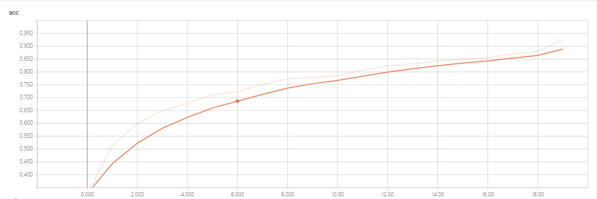
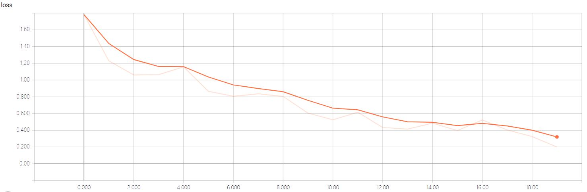
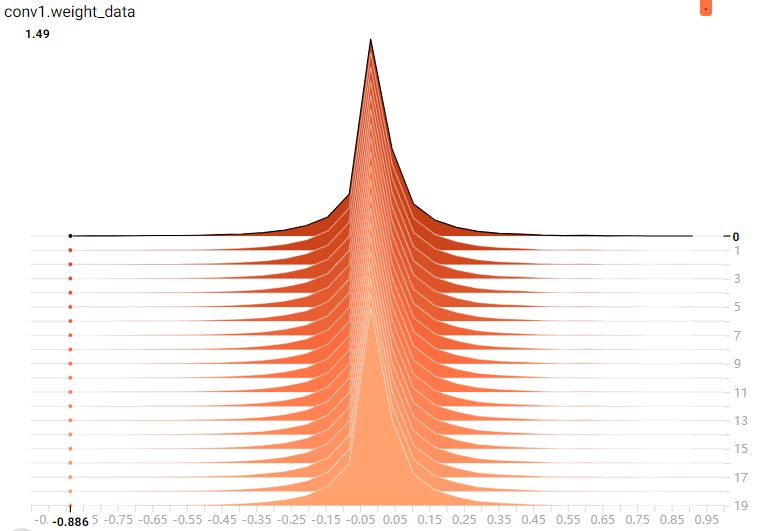
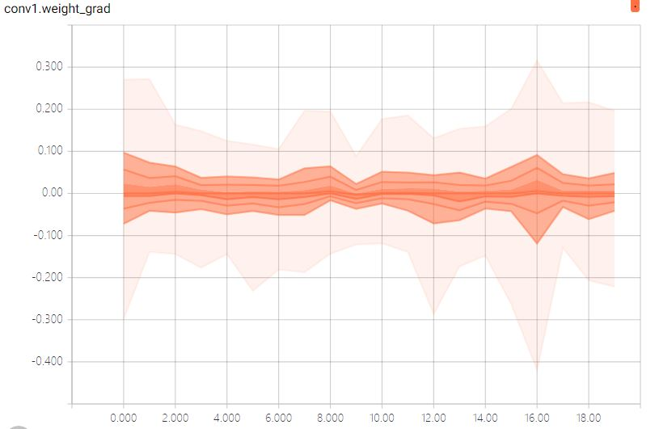
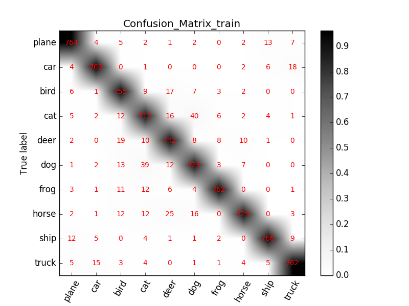
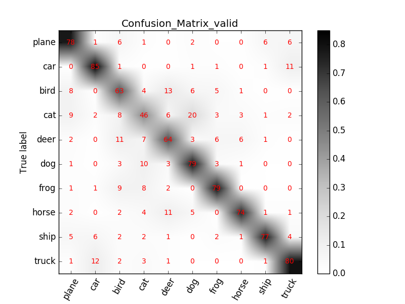

---
layout: post
title:  pytorch学习总结
---
&emsp;&emsp;在过去4天的时间内，粗略的学习了《PyTorch_tutorial_0.0.4_余霆嵩》。这篇文章从cifar-10数据集的识别为目的，讲解了如何使用pytorch进行数据集的读取、模型的构建、损失函数与优化器的选择、可视化模型。在此基础上，为了进一步使得自己入门pytorch，我使用它构建了ResNet34模型，并选择了合适的损失函数、优化器训练该模型对cifar10数据集进行识别分类，同时在tensorboard上可视化了loss、acc、每一层参数的变化。以上pytorch构建的模型开源到了：https://github.com/AI-Chen/ResNet34

----
### 1.数据的处理与读取
&emsp;&emsp;关于如何将cifar-10的数据集转换为图片png的格式这里就不讲了。推广到CV其它图像处理任务所需要掌握的核心知识在于：1） torch.utils.data中Dataset类与DataLoder类对数据读取的机制；2）torchvision中transforms类对数据的增强与标准化。<br>
&emsp;&emsp;pytorch中对数据的读取主要步骤如下：
* 制作图片的索引；
* 构建Dataset子类；
* 使用Dataset子类初始号DataLoader从而返回批量的读取数据；<br>

&emsp;&emsp;首先对于已经划分好存储于data/train、data/valid的10个类别的图片数据。我使用了以下代码对它们制作索引，并将其存储于data/train.txt、data/valid.txt中。
> * *gen_txt函数* :用于获取指定文件夹下所有png图片的路径以及label。值得一提的是，这里获取png图片的路径要是针对train.py文件的相对路径，否则会找不到文件（代码i_dir = i_dir.replace('../', '')便是起到这个作用。因为在这个语句之前找到的路径是相对于gen_txt函数所在文件的。

```
# coding:utf-8
import os
'''
    为数据集生成对应的txt文件
'''

train_txt_path = '../Data/train.txt'
train_dir = '../data/train/'

valid_txt_path = '../Data/valid.txt'
valid_dir = '../data/valid/'


def gen_txt(txt_path, img_dir):
    f = open(txt_path, 'w')

    for root, s_dirs, _ in os.walk(img_dir, topdown=True):  # 获取 train文件下各文件夹名称
        for sub_dir in s_dirs:
            i_dir = os.path.join(root, sub_dir)             # 获取各类的文件夹 绝对路径
            img_list = os.listdir(i_dir)                    # 获取类别文件夹下所有png图片的路径
            i_dir = i_dir.replace('../', '')
            for i in range(len(img_list)):
                if not img_list[i].endswith('png'):         # 若不是png文件，跳过
                    continue
                label = img_list[i].split('_')[0]
                img_path = os.path.join(i_dir, img_list[i])
                line = img_path + ' ' + label + '\n'
                f.write(line)
    f.close()


if __name__ == '__main__':
    gen_txt(train_txt_path, train_dir)
    gen_txt(valid_txt_path, valid_dir)
```

&emsp;&emsp;其次，构建Dataset的子类MyDataset，用于利用上一步制作的索引来找寻图片，返回图片数据与相应label。
> * *class Dataset*：来看一下它的源码：
```
class Dataset(object):
        """An abstract class representing a Dataset.
        All other datasets should subclass it. All subclasses should override
        ``__len__``, that provides the size of the dataset, and ``__getitem__``,
        supporting integer indexing in range from 0 to len(self) exclusive.
        """
        def __getitem__(self, index):
        raise NotImplementedError
        def __len__(self):
        raise NotImplementedError
        def __add__(self, other):
        return ConcatDataset([self, other])
```
这里关注的重点是\__getitem__函数。getitem 接收一个 index，然后返回图片数据和标签，这个index 通常指的是一个 list 的 index，这个 list 的每个元素就包含了图片数据的路径和标签信息。在这一次的任务中，这个list可以由我们所制作txt形式的索引文件得到。
* *class MyDataset*：再来看一下为本次任务所写的继承了Dataset的Mydataset类：
```
from PIL import Image
from torch.utils.data import Dataset
import numpy as np
import torch
from torch.autograd import Variable
import os
import matplotlib.pyplot as plt
class MyDataset(Dataset):
    def __init__(self, txt_path, transform = None, target_transform = None):
        fh = open(txt_path, 'r')
        imgs = []
        for line in fh:
            line = line.rstrip()
            words = line.split() #分割字符串为路径和label
            imgs.append((words[0], int(words[1])))
        self.imgs = imgs        # 最主要就是要生成这个list， 然后DataLoader中给index，通过getitem读取图片数据
        self.transform = transform
        self.target_transform = target_transform
    def __getitem__(self, index):
        fn, label = self.imgs[index]
        img = Image.open(fn).convert('RGB')     # 像素值 0~255，在transfrom.totensor会除以255，使像素值变成 0~1
        if self.transform is not None:
            img = self.transform(img)   # 在这里做transform，转为tensor等等
        return img, label
    def __len__(self):
        return len(self.imgs)
```
 *\__init__* 用于读取txt文件转变为一个list的数据结构。同时初始化transform（用于数据增强与标准化）。在本次任务中，所用transform的处理如下：
```
trainTransform = transforms.Compose([
    transforms.Resize(32),
    transforms.RandomCrop(32, padding=4),
    transforms.ToTensor(),
    normTransform
    ])
validTransform = transforms.Compose([
    transforms.ToTensor(),
    normTransform
    ])
```
其中trainTransform表示读取训练数据时的数据增强与标准化处理。transforms.Compose表示将所需要进行的处理给 compose 起来，并且需要注意顺序。compose 起来的操作包括：<br>
&emsp;&emsp;1）*transforms.Resize(32)* 将图像大小调整为32\*32；<br><br>
&emsp;&emsp;2）*transforms.RandomCrop(32, padding=4)* 进行随机裁剪。其原理为：在裁剪之前先对图片的上下左右均填充上 4 个 pixel，值为0，即变成一个 36*36 的数据，然后再随机进行 32*32 的裁剪；<br><br>
&emsp;&emsp;3）*transforms.ToTensor()* 在这里会对数据进行 transpose，原来是 h*w*c，会经过 img = img.transpose(0,1).transpose(0, 2).contiguous()，变成 c*h*w 再除以 255，使得像素值归一化至[0-1]之间；<br><br>
&emsp;&emsp;4）*normTransform=transforms.Normalize(normMean, normStd)* 是对图像进行标准化。在进行 Normalize 时，需要设置均值和方差，这是需要自己写程序去计算的。<br><br>
&emsp;&emsp;当然，在transform中还有很多诸如翻转、变换在内的操作。他们可以根据具体的任务加到transforms.Compose中。另外，值得一提的是，对图像数据进行这些transfrom操作之后将会覆盖原始图像。<br><br>
 *\__getitem__* 根据list去读取相应的图片数据，并对数据进行transform后返回，同时返回的还有相对应的label。

&emsp;&emsp;最后，使用MyDataset初始化Dataloader后可返回一个batchsize数量的图片数据。同时，值得注意的是触达Dataloader后，会进行一个iteration的数据读取。换句话说就是读完整个数据集后，Dataloader的才算停止。以下是用DataLoader读取数据的代码：
```
# 构建MyDataset实例
train_data = MyDataset(txt_path=train_txt_path, transform=trainTransform)
valid_data = MyDataset(txt_path=valid_txt_path, transform=validTransform)

# 构建DataLoder
train_loader = DataLoader(dataset=train_data, batch_size=train_bs, shuffle=True)
valid_loader = DataLoader(dataset=valid_data, batch_size=valid_bs)

for i, data in enumerate(valid_loader):
      # 获取图片和标签
      images, labels = data
      images, labels = Variable(images), Variable(labels)
```
&emsp;&emsp;以上就是读取数据的一个完整过程。

### 2.ResNet34的构建
&emsp;&emsp;模型的构建包括模型的定义，模型参数初始化方法，模型的保存和加载，模型的 finetune(本质上还是模型权值初始化)等几部分。<br>
&emsp;&emsp;首先是模型的构建（这里以我构建的ResNet34为例）。可以看到模型的搭建需要三个要素：<br>
&emsp;&emsp;1）必须继承 nn.Module 这个类，要让 PyTorch 知道这个类是一个 Module。<br>
&emsp;&emsp;2）在\__init__(self)中设置好需要的“组件"(如 conv、pooling、Linear、BatchNorm等)。<br>
&emsp;&emsp;3）在 forward(self, x)中用定义好的“组件”进行组装，就像搭积木，把网络结构搭建出来，这样一个模型就定义好了。<br>
> * 可以看到ResNet、bottleneck、Basicblock这三个模型都继承了torch.nn中的Module类。
* 以BasicBlock为例，在\__init__函数中构建了conv1、bn1、conv2、bn2、downsample等组件。并在forward函数中应用BasicBlock的逻辑搭建了模块（值得注意的是\__init__函数中构建的模块名就是之后保存模型时这一个组件所包含参数的键名）
* torch.nn.Sequential 其实就是 Sequential 容器，该容器将一系列操作按先后顺序给包起
来，方便重复使用。例如 Resnet 中有很多重复的 block，就可以用 Sequential 容器把重复的地方包起来。

```
#coding:utf8
from torch import nn
def conv3x3(in_planes, out_planes, stride=1, groups=1, dilation=1):
    """3x3 convolution with padding"""
    return nn.Conv2d(in_planes, out_planes, kernel_size=3, stride=stride,
                     padding=dilation, groups=groups, bias=False, dilation=dilation)


def conv1x1(in_planes, out_planes, stride=1):
    """1x1 convolution"""
    return nn.Conv2d(in_planes, out_planes, kernel_size=1, stride=stride, bias=False)


class BasicBlock(nn.Module):
    expansion = 1

    def __init__(self, inplanes, planes, stride=1, downsample=None, groups=1,
                 base_width=64, dilation=1, norm_layer=None):
        super(BasicBlock, self).__init__()
        if norm_layer is None:
            norm_layer = nn.BatchNorm2d
        if groups != 1 or base_width != 64:
            raise ValueError('BasicBlock only supports groups=1 and base_width=64')
        if dilation > 1:
            raise NotImplementedError("Dilation > 1 not supported in BasicBlock")
        # Both self.conv1 and self.downsample layers downsample the input when stride != 1
        self.conv1 = conv3x3(inplanes, planes, stride)
        self.bn1 = norm_layer(planes)
        self.relu = nn.ReLU(inplace=True)
        self.conv2 = conv3x3(planes, planes)
        self.bn2 = norm_layer(planes)
        self.downsample = downsample
        self.stride = stride

    def forward(self, x):
        identity = x

        out = self.conv1(x)
        out = self.bn1(out)
        out = self.relu(out)

        out = self.conv2(out)
        out = self.bn2(out)

        if self.downsample is not None:
            identity = self.downsample(x)

        out += identity
        out = self.relu(out)

        return out


class Bottleneck(nn.Module):
    expansion = 4

    def __init__(self, inplanes, planes, stride=1, downsample=None, groups=1,
                 base_width=64, dilation=1, norm_layer=None):
        super(Bottleneck, self).__init__()
        if norm_layer is None:
            norm_layer = nn.BatchNorm2d
        width = int(planes * (base_width / 64.)) * groups
        # Both self.conv2 and self.downsample layers downsample the input when stride != 1
        self.conv1 = conv1x1(inplanes, width)
        self.bn1 = norm_layer(width)
        self.conv2 = conv3x3(width, width, stride, groups, dilation)
        self.bn2 = norm_layer(width)
        self.conv3 = conv1x1(width, planes * self.expansion)
        self.bn3 = norm_layer(planes * self.expansion)
        self.relu = nn.ReLU(inplace=True)
        self.downsample = downsample
        self.stride = stride

    def forward(self, x):
        identity = x

        out = self.conv1(x)
        out = self.bn1(out)
        out = self.relu(out)

        out = self.conv2(out)
        out = self.bn2(out)
        out = self.relu(out)

        out = self.conv3(out)
        out = self.bn3(out)

        if self.downsample is not None:
            identity = self.downsample(x)

        out += identity
        out = self.relu(out)

        return out


class ResNet(nn.Module):

    def __init__(self, block, layers, num_classes=10, zero_init_residual=False,
                 groups=1, width_per_group=64, replace_stride_with_dilation=None,
                 norm_layer=None):
        super(ResNet, self).__init__()
        if norm_layer is None:
            norm_layer = nn.BatchNorm2d
        self._norm_layer = norm_layer

        self.inplanes = 64
        self.dilation = 1
        if replace_stride_with_dilation is None:
            # each element in the tuple indicates if we should replace
            # the 2x2 stride with a dilated convolution instead
            replace_stride_with_dilation = [False, False, False]
        if len(replace_stride_with_dilation) != 3:
            raise ValueError("replace_stride_with_dilation should be None "
                             "or a 3-element tuple, got {}".format(replace_stride_with_dilation))
        self.groups = groups
        self.base_width = width_per_group
        self.conv1 = nn.Conv2d(3, self.inplanes, kernel_size=7, stride=2, padding=3,
                               bias=False)
        self.bn1 = norm_layer(self.inplanes)
        self.relu = nn.ReLU(inplace=True)
        self.maxpool = nn.MaxPool2d(kernel_size=3, stride=2, padding=1)
        self.layer1 = self._make_layer(block, 64, layers[0])
        self.layer2 = self._make_layer(block, 128, layers[1], stride=2,
                                       dilate=replace_stride_with_dilation[0])
        self.layer3 = self._make_layer(block, 256, layers[2], stride=2,
                                       dilate=replace_stride_with_dilation[1])
        self.layer4 = self._make_layer(block, 512, layers[3], stride=2,
                                       dilate=replace_stride_with_dilation[2])
        self.avgpool = nn.AdaptiveAvgPool2d((1, 1))
        self.fc_out = nn.Linear(512 * block.expansion, num_classes)

        for m in self.modules():
            if isinstance(m, nn.Conv2d):
                nn.init.kaiming_normal_(m.weight, mode='fan_out', nonlinearity='relu')
            elif isinstance(m, (nn.BatchNorm2d, nn.GroupNorm)):
                nn.init.constant_(m.weight, 1)
                nn.init.constant_(m.bias, 0)

        # Zero-initialize the last BN in each residual branch,
        # so that the residual branch starts with zeros, and each residual block behaves like an identity.
        if zero_init_residual:
            for m in self.modules():
                if isinstance(m, Bottleneck):
                    nn.init.constant_(m.bn3.weight, 0)
                elif isinstance(m, BasicBlock):
                    nn.init.constant_(m.bn2.weight, 0)

    def _make_layer(self, block, planes, blocks, stride=1, dilate=False):
        norm_layer = self._norm_layer
        downsample = None
        previous_dilation = self.dilation
        if dilate:
            self.dilation *= stride
            stride = 1
        if stride != 1 or self.inplanes != planes * block.expansion:
            downsample = nn.Sequential(
                conv1x1(self.inplanes, planes * block.expansion, stride),
                norm_layer(planes * block.expansion),
            )

        layers = []
        layers.append(block(self.inplanes, planes, stride, downsample, self.groups,
                            self.base_width, previous_dilation, norm_layer))
        self.inplanes = planes * block.expansion
        for _ in range(1, blocks):
            layers.append(block(self.inplanes, planes, groups=self.groups,
                                base_width=self.base_width, dilation=self.dilation,
                                norm_layer=norm_layer))

        return nn.Sequential(*layers)

    def forward(self, x):
        x = self.conv1(x)
        x = self.bn1(x)
        x = self.relu(x)
        x = self.maxpool(x)

        x = self.layer1(x)
        x = self.layer2(x)
        x = self.layer3(x)
        x = self.layer4(x)

        x = self.avgpool(x)
        x = x.reshape(x.size(0), -1)
        x = self.fc_out(x)

        return x
```
&emsp;&emsp;其次是模型参数初始化方法。参数初始化可以采用自定义的规则进行初始化，也可以加载已经预训练好的权重。采用自定义的规则进行初始化实在模型类中定义权值初始化函数 *initialize_weights*。这里总结集中初始化参数的规则，它们由 torch.nn.init提供：
* *torch.nn.init.xavier_uniform_(tensor, gain=1)*:xavier 初始化方法中服从均匀分布 U(−a,a)。分布的参数 a = gain * sqrt(6/fan_in+fan_out)，这里有一个 gain，增益的大小是依据激活函数类型来设定。eg:nn.init.xavier_uniform_(w,gain=nn.init.calculate_gain('relu'))。<br>这个初始化方法，也称为 Glorot initialization。
* *torch.nn.init.xavier_normal_(tensor, gain=1)* :xavier 初始化方法中服从正态分布.
* *torch.nn.init.kaiming_uniform_(tensor,a=0,mode='fan_in',nonlinearity='leaky_relu')* :此为kaiming均匀分布，U～（-bound, bound）, bound = sqrt(6/(1+a^2)\*fan_in)其中，a 为激活函数的负半轴的斜率，relu 是 0mode- 可选为 fan_in或 fan_out, fan_in 使正向传播时，方差一致; fan_out 使反向传播时，方差一致nonlinearity- 可选 relu 和 leaky_relu ，默认值为为leaky_relu
* *torch.nn.init.kaiming_normal_(tensor, a=0, mode='fan_in', nonlinearity='leaky_relu')* :kaiming正态分布。

&emsp;&emsp;在本次学习中我采用了加载预训练参数的方法。
> * torch.save（）:模型参数的保存；
*  torch.load（）：加载预训练参数字典；
*  模型名.state_dict():获取已创建 net 的 state_dict
* pretrained_dict_1 = {k: v for k, v in pretrained_dict.items() if k in net_state_dict}:将 pretrained_dict 里不属于 net_state_dict 的键剔除掉;
* net_state_dict.update(pretrained_dict_1):用预训练模型的参数字典 对 新模型的参数字典 net_state_dict 进行更新;
* 模型名.load_state_dict(net_state_dict)：将更新了参数的字典 “放”回到网络中。

```
#           初始化权值
pretrained_dict = torch.load('ResNet34_pretrained/resnet34-333f7ec4.pth')
pretrained_dict_keys = [name for name in pretrained_dict.keys()]
net_state_dict = net.state_dict()
net_state_dict_keys = [name for name in net_state_dict.keys()]

net_state_dict = net.state_dict()
#model是自己定义好的新网络模型，将pretrained_dict和model_dict中命名一致的层加入pretrained_dict（包括参数)。
pretrained_dict_1 = {k: v for k, v in pretrained_dict.items() if k in net_state_dict}
net_state_dict.update(pretrained_dict_1)
net.load_state_dict(net_state_dict)
```
&emsp;&emsp;模型的 finetune本质上还是模型参数的加载。值得一提的是模型的参数的保存是以字典形式的方式保存的。想对指定层单独加载参数只需要根据其相应的键名取值权值再进行更新即可。以下是我写的只对ResNet全连接层前的参数的进行加载的代码：
```
pretrained_dict = torch.load('ResNet34_pretrained/resnet34-333f7ec4.pth')
pretrained_dict_keys = [name for name in pretrained_dict.keys()]
print(len(pretrained_dict_keys))
net_state_dict = net.state_dict()
net_state_dict_keys = [name for name in net_state_dict.keys()]
print(len(net_state_dict_keys))
for i , name in enumerate(net_state_dict_keys):
    if name != 'fc.weight' and  name !="fc.bias":
        print(i)
        net_state_dict[name].copy_(pretrained_dict[pretrained_dict_keys[i]])
```


### 3.损失函数、优化器、超参数设置
&emsp;&emsp;准备好数据，设计好模型，接下来就是选择合适的损失函数，并且采用合适的优化器进行优化(训练)模型。<br>
&emsp;&emsp;优化，即优化网络权值使得损失函数值变小。但是，损失函数值变小是否能代表模型的分类/回归精度变高呢？那么多种损失函数，应该如何选择呢？pytorch提供了17种损失函数。这里总结其中常用的交叉熵损失函数。
> *torch.nn.CrossEntropyLoss(weight=None,size_average=None,ignore_index=100,reduce=None, reduction='elementwise_mean')*:将输入经过 softmax 激活函数之后，再计算其与 target 的交叉熵损失。即该方法将nn.LogSoftmax()和 nn.NLLLoss()进行了结合。严格意义上的交叉熵损失函数应该是nn.NLLLoss()。在多分类任务中，经常采用 softmax 激活函数+交叉熵损失函数，因为交叉熵᧿述了两个概率分布的差异，然而神经网络输出的是向量，并不是概率分布的形式。所以需要 softmax激活函数将一个向量进行“归一化”成概率分布的形式，再采用交叉熵损失函数计算 loss。

&emsp;&emsp;当数据、模型和损失函数确定，任务的数学模型就已经确定，接着就要选择一个合适
的优化器(Optimizer)对该模型进行优化。常用的优化器有：SGD、ASGD 等。<br>
> * *torch.optim.SGD(params, lr=<object
object\>, momentum=0, dampening=0, weight_decay=0, nesterov=False)* ：可实现 SGD 优化算法，带动量 SGD 优化算法，带 NAG(Nesterov acceleratedgradient)动量 SGD 优化算法,并且均可拥有 weight_decay 项。<br>
* *torch.optim.ASGD(params, lr=0.01, lambd=0.0001, alpha=0.75, t0=1000000.
0, weight_decay=0)* :ASGD 也成为 SAG，均表示随机平均梯度下降(Averaged Stochastic GradientDescent)，简单地说 ASGD 就是用空间换时间的一种 SGD。

&emsp;&emsp;有时候还需要对不同的层设置不同的学习率。它的实现如下：
```
# 将fc_out层的参数从原始网络参数中剔除
ignored_params = list(map(id, net.fc_out.parameters()))
base_params = filter(lambda p: id(p) not in ignored_params, net.parameters())

# 为fc_out层设置需要的学习率
optimizer = optim.SGD([
    {'params': base_params},
    {'params': net.fc_out.parameters(), 'lr': lr_init*10}],  lr_init, momentum=0.9, weight_decay=1e-4)
```
&emsp;&emsp;第一行+ 第二行的意思就是，将 fc3 层的参数 net.fc3.parameters() 从原始参数net.parameters()中剥离出来。base_params 就是剥离了 fc3 层的参数的其余参数，然后在优化器中为 fc3 层的参数单独设定学习率。optimizer = optim.SGD(......)这里的意思就是 base_params 中的层，用 lr_init, momentum=0.9,weight_decay=1e-4。fc3 层设定学习率为： lr_init*10 。
&emsp;&emsp;此外，我们知道，学习率随着训练过程的深入，将会根据相应设定的规则变化。pytorch提供了三大类的规则以供选择：
* 有序调整：依一定规律有序进行调整，这一类是最常用的，分别是等间隔下降(Step)，按需设定下降间隔(MultiStep)，指数下降(Exponential)和 CosineAnnealing。这四种方法的调整时机都是人为可控的，也是训练时常用到的。<br><br>
* 自适应调整：依训练状况伺机调整，这就是 ReduceLROnPlateau 方法。该法通过监测某一
指标的变化情况，当该指标不再怎么变化的时候，就是调整学习率的时机，因而属于自适
应的调整。<br><br>
* 自定义调整: Lambda。Lambda 方法ᨀ供的调整策略十分灵活，我们可以为不
同的层设定不同的学习率调整方法，这在 fine-tune 中十分有用，我们不仅可为不同的层
设定不同的学习率，还可以为其设定不同的学习率调整策略。
### 4.模型的训练
&emsp;&emsp;模型的训练时在综合前面三节所讲的知识上进行的。这里不加赘述。唯一想讲一下的是我在模型训练的代码中加入了监测模型的代码。监测的结果将在第四节中展示如下：
* 添加loss、acc的变化图：
```
    writer.add_scalar('loss', loss_avg, epoch, walltime=epoch)
    writer.add_scalar('acc', correct / total, epoch, walltime=epoch)
```
* 添加各层参数的变化图：
```
for name, layer in net.named_parameters():
        writer.add_histogram(name + '_grad', layer.grad.cpu().data.numpy(), epoch)
        writer.add_histogram(name + '_data', layer.cpu().data.numpy(), epoch)
```
* 绘制混淆矩阵：
```
conf_mat_train, train_acc = validate(net, train_loader, 'train', classes_name)
conf_mat_valid, valid_acc = validate(net, valid_loader, 'valid', classes_name)
show_confMat(conf_mat_train, classes_name, 'train', log_dir)
show_confMat(conf_mat_valid, classes_name, 'valid', log_dir)
```

### 5.检测模型（可视化）
* loss、acc的变化图：
<br><br>
<br><br>
* 各层参数的变化图（以第一个卷积层为例）：
<br><br>
<br><br>
* 混淆矩阵：
<br><br>
<br><br>
