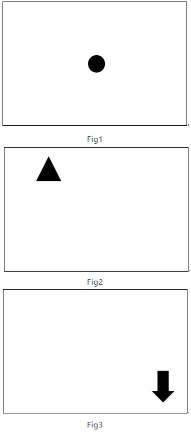
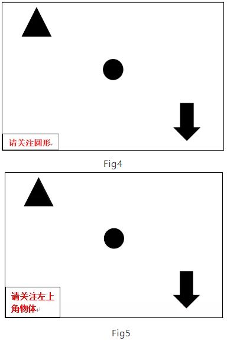
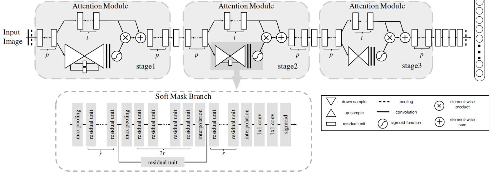
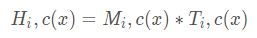
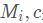
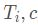
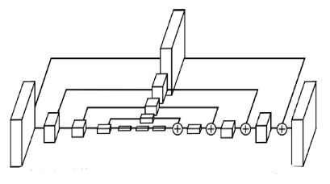
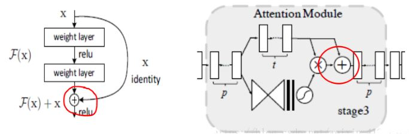

**摘要**：论文中作者对所提出的残差注意力网络的定义是：A convolutional network that adopts mixed attention mechanism in “very deep” structure。也就是说这个网络首先是一个卷积神经网络，只是它的特点在于引入了混合注意力机制，并且网络结构非常地深。同时，作者明确了图像视觉中的注意力机制：一系列的注意力分配系数，也就是一系列权重参数，可以用来强调或选择目标处理对象的重要信息，并且抑制一些无关的细节信息。

----
### 1.注意力机制（attention mechanism）
#### 1.1、概念
&emsp;&emsp;无论在神经科学领域还是人工智能领域，人类视觉系统都是一个值得关注的话题。现如今很多算法，如神经网络，都是启发于或借鉴人类的视觉机理来进行处理对应的计算机视觉任务。那么什么是注意力？举个例子，当我们看Fig1时，我们自然而然的将注意力关注到位于图中心的黑色小球上，这就是一种典型的bottom-up attention。而随着关注物体的移动，人类的注意力也在随之移动。当我们看Fig2和Fig3的时候，随着物体的位置变换，人类的注意力关注点也随之变化。  
  
&emsp;&emsp;无论在神经科学领域还是人工智能领域，人类视觉系统都是一个值得关注的话题。现如今很多算法，如神经网络，都是启发于或借鉴人类的视觉机理来进行处理对应的计算机视觉任务。那么什么是注意力？举个例子，当我们看Fig1时，我们自然而然的将注意力关注到位于图中心的黑色小球上，这就是一种典型的bottom接下来再关注以下一组图片，在看Fig4和Fig5之前，请先看左下角指令。当遵从左下角指令来关注物体时，我们会根据左下角的指令（task）来决定attention的关注区域或是物体类别。以上两种attention即是我们通常所提到的bottom-up attention（Fig1,Fig2,Fig3）和top-down attention（Fig4,Fig5）。 
  
&emsp;&emsp;而计算机视觉（computer vision）中的注意力机制（attention）的基本思想就是想让系统学会注意力——能够忽略无关信息而关注重点信息。
#### 1.2、分类
&emsp;&emsp;就注意力的可微性来分：
* **Hard-attention**：就是0/1问题，哪些区域是被 attentioned，哪些区域不关注.硬注意力（强注意力）与软注意力不同点在于，首先强注意力是更加关注点，也就是图像中的每个点都有可能延伸出注意力，同时强注意力是一个随机的预测过程，更强调动态变化。当然，最关键是强注意力是一个不可微的注意力，训练过程往往是通过增强学习(reinforcement learning)来完成的。（参考文章：Diversified visual attention networks for fine-grained object classification—2016、Deep networks with internal selective attention through feedback connections (通道域)—NIPS 2014）
* **Soft-attention**：[0,1]间连续分布问题，每个区域被关注的程度高低，用0~1的score表示.软注意力的关键点在于，这种注意力更关注区域或者通道，而且软注意力是确定性的注意力，学习完成后直接可以通过网络生成，最关键的地方是软注意力是可微的，这是一个非常重要的地方。可以微分的注意力就可以通过神经网络算出梯度并且前向传播和后向反馈来学习得到注意力的权重。（相关论文：The application of two-level attention models in deep convolutional neural network for fine-grained image classification—CVPR2015）

&emsp;&emsp;就注意力关注的域来分：
* 空间域(spatial domain)：Spatial Transformer Networks(空间域注意力)—2015 nips、Non-local Neural Networks, CVPR2018；
* 通道域(channel domain)：SENET （通道域）—2017CPVR
* 层域(layer domain)：PAN: Pyramid Attention Network for Semantic Segmentation(层域)—CVPR2018；
* 混合域(mixed domain)：Residual Attention Network(混合域)—2017（即本次阅读文章）、CBAM: Convolutional Block Attention Module(通道域+空间域), ECCV2018、Dual Attention Network for Scene Segmentation(空间域+通道域), CPVR2019；
* 时间域(time domain)：时间域注意力(RNN)；

&emsp;&emsp;另外，一个重要的概念是Self-attention（自注意力），就是 feature map 间的自主学习，分配权重（可以是 spatial，可以是 temporal，也可以是 channel间）

### 2.Residual Attention Network
  
&emsp;&emsp;如上图所示是Residual Attention Network的基本结构。它由多个注意力模块堆叠而成。每个注意力模块被分成了两个分支：mask brunch 和 trunk branch。注意力模块的输出为：。其中是mask分支输出的注意力权重，是trunk分支经过一系列操作所提取出的特征图表示，输出即为二者的点积。 
> * trunk分支：与传统的卷积网络特征处理相似，通过多次卷积操作提取特征。  
* mask分支：是注意力模块的核心部件，主要由一个buttom-up top-down的结构，这种结构也是一种encoder-decoder模型，形状与沙漏网络(hourglass network)相似。它的结构如下图，：

&emsp;&emsp;buttom-up部分：执行下采样(down sample)，多次进行最大池化操作扩大接受域，直到达到最低分辨率。作用效果是：产生低分辨率、强语义信息的特征图，从而收集整个图片的全局信息。 
&emsp;&emsp;top-down部分：执行上采样(up sample)线性插值，直到特征图尺寸与输入时相等。作用效果是：扩展Bottom-up所产生的特征图，使其尺寸与输入Bottom-up前的特征图大小相同，从而对输入特征图的每个像素进行推理选择。
所以，综上mask分支的作用总结如下： 
&emsp;&emsp;前向推导中主要起特征选择的作用，可将mask分支的输出看作是trunk分支神经元的控制门，过滤不重要的信息，强调重要信息。后向传播中起梯度更新过滤的作用。由于mask分支仅进行下采样和上采样操作，所以在反向传播中没有参数更新，那么它对trunk分支的选择性将不会改变，即使有噪音标签更新了trunk分支中的参数，mask分支也会将其剔除掉，这使得网络对于标签噪音具有很好的健壮性。 
&emsp;&emsp;在mask 输出之前，通过改变激活函数中的标准化方式，对mask 中的Attention添加不同的约束，可以产生三种类型的attention:channel attention（对各个通道所对应的空间位置的值进行L2标准化，去掉空间信息） 、spatial attention（对所有通道的特征图进行标准化，然后通过sigmoid函数来获取只含空间信息的attention）、Mix Attention（对所有通道、空间位置直接使用sigmoid函数；**实验表明不添加任何约束的mixed attention的错误率最低！** 
&emsp;&emsp;在对网络深度进行扩展时，主要存在的问题是，简单的注意力模块堆叠会造成明显的性能下降，原因如下：
* mask的取值范围为[0,1]，在深层网络中重复地进行点积，会消减特征的值;
* mask潜在地打破了trunk分支的一些特性，比如说残差单元的恒等映射(identical mapping)解决方案：作者类比残差学习提出了注意力残差学习，仿其提出假设：  
  
&emsp;&emsp;这时候可以得到的特征更为丰富，从而能够更好的注意关键特征。

### 3.总结
&emsp;&emsp;该文章的注意力机制的创新点在于提出了残差注意力学习(residual attention learning)，**不仅只把mask之后的特征张量作为下一层的输入，同时也将mask之前的特征张量作为下一层的输入**，这时候可以得到的特征更为丰富，从而能够更好的注意关键特征。
